```{r setup, include=FALSE}
knitr::opts_chunk$set(warning = FALSE, message = FALSE, 
                      fig.retina = 3, fig.align = "center")
```

```{r packages-data, include=FALSE}
library(tidyverse)
library(ggdag)
```

```{r xaringanExtra, echo=FALSE}
xaringanExtra::use_xaringan_extra(c("tile_view"))
```

class: center middle main-title section-title-1

# Asking Causal Questions

.class-info[

**Session 3**

.light[STA 379/679: Causal Inference<br>
Lucy D'Agostino McGowan
]

]

---
## `r emo::ji("wave")`

##  Lucy D'Agostino McGowan

<i class="fa fa-envelope"></i> &nbsp; [mcgowald@wfu.edu](mailto:mcgowald@wfu.edu) <br>
<i class="fa fa-calendar"></i> &nbsp; Office hours: Tuesday 10a-11a, 1p-2p
---

class: middle, center

Everything you will need will be posted at:

# [bit.ly/sta-679-s22](http://bit.ly/sta-679-s22)

---

class: title title-1, center

# `r fontawesome::fa("laptop")` Lab 00
<br><br>

---

layout: false

class: center middle section-title section-title-1

# Class details

---
class: title title-1

# Academic integrity

Adhere to the Wake Forest Honor Code. Academic dishonesty will not be tolerated.

---
class: title title-1

# Sharing/reusing code

* There are many online resources for sharing code (for example, StackOverflow) - you **may** use these resources but **must explicitly cite** where you have obtained code (both code you used directly and "paraphrased" code / code used as inspiration). Any reused code that is not explicitly cited will be treated as plagiarism.
---
class: title title-1

# Sharing/reusing code

* You **may** discuss the content of assignments with others in this class. If you do so, please acknowledge your collaborator(s) at the top of your assignment, for example: "Collaborators: Gertrude Cox, Florence Nightingale David". Failure to acknowledge collaborators will result in a grade of 0. You **may not** copy code and/or answers **directly** from another student. If you copy someone else's work, both parties will receive a grade of 0.
--

* Rather than copying someone else's work, ask for help. You are not alone in this course!

---
class: title title-1

# Course components:

- Reflections
- Application exercises: Usually start in class and finish in teams by the next class period, check/no check
- Assessment
- Lab: start in class,
- Midterm
- Final Projects

---
class: title title-1

# Grading


Component             | Weight
----------------------|----------------
Reflections | 5%  
Application exercises | 10%  
Midterm | 15%  
Assessments | 20%  
Labs | 30%  
Final Project | 20%

---
class: title title-1

# Late/missed work policy


- Late work policy for homework and lab assignments:
    - late, but within 24 hours of due date/time: -50%
    - any later: no credit

---

class: title title-1

# Goals of Analysis

.box-inv-1.medium[description]

--

.box-inv-1.medium[prediction]

--

.box-1.medium[explanation]

---

class: title title-1

# Description

* What phenomena occur / occurred in the past?  

--
* What is the prevalence of diabetes in the United States?  

--
* What are the demographics of our customers?

---

class: title title-1

# Prediction

* This often involves predicting *whether* a certain phenomena will occur given a set of circumstances  

--
* How many people will buy our product?  

--
* How much will this house sell for next year?

---

class: title title-1

# Explanation

* Involves understanding *why* a phenomena occurs  

--
* Does smoking cause lung cancer?  

--
* Does a SARS-CoV-2 infection increase the likelihood of diabetes diagnosis in kids?

---
class: section-title-1 center middle title-1

# The first step is asking a good causal question

---

class: title title-1

# Diagramming a causal claim

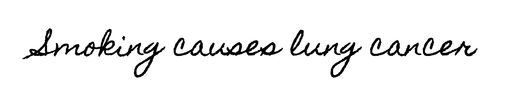

---

class: title title-1

# Diagramming a causal claim

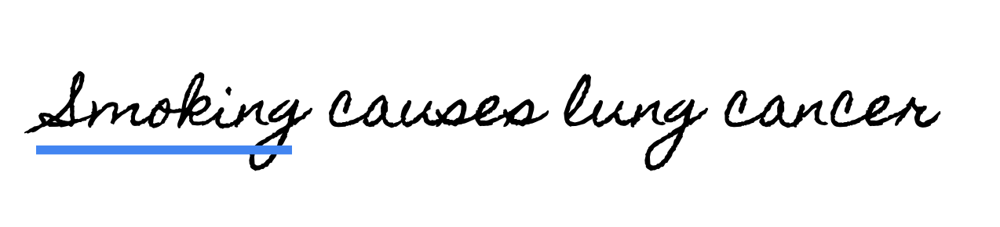

---

class: title title-1

# Diagramming a causal claim

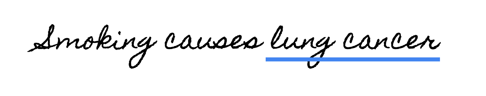

---

class: title title-1

# Diagramming a causal claim

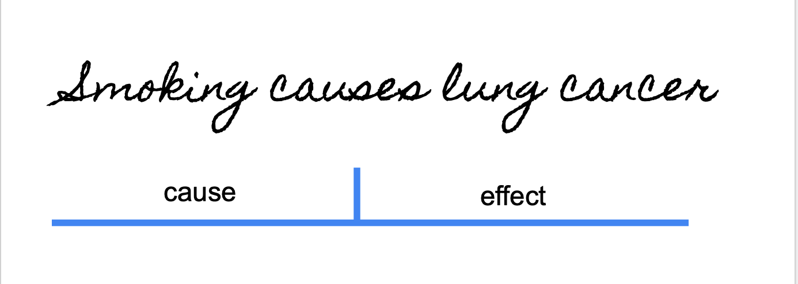

---

class: title title-1

# Diagramming a causal claim

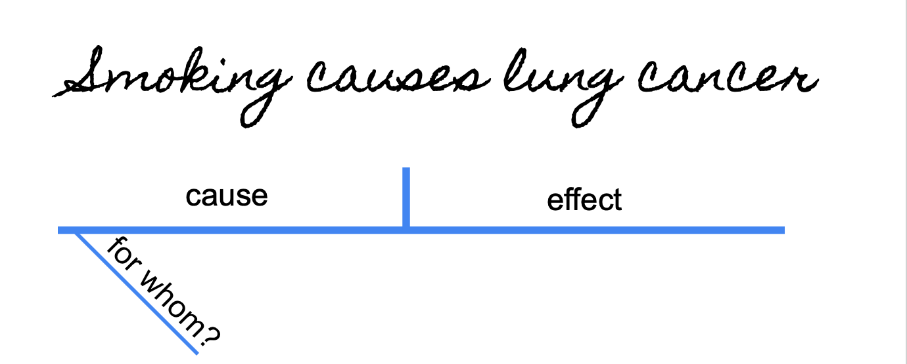

---

class: title title-1

# Diagramming a causal claim

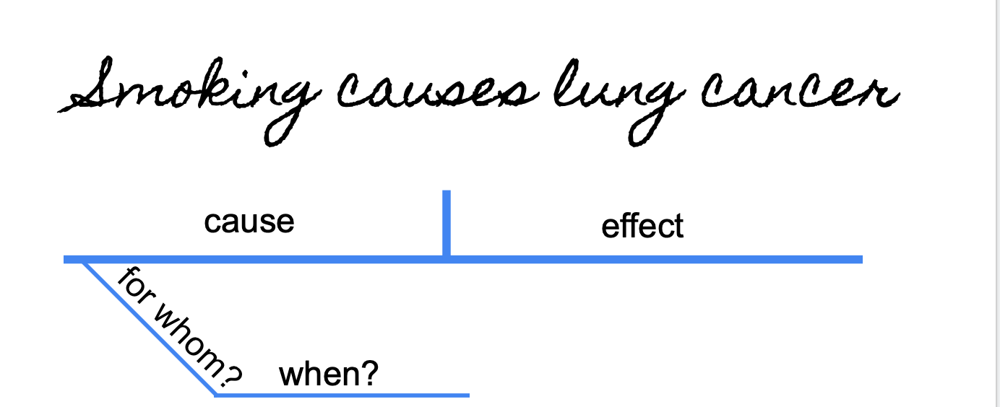

---

class: title title-1

# Diagramming a causal claim

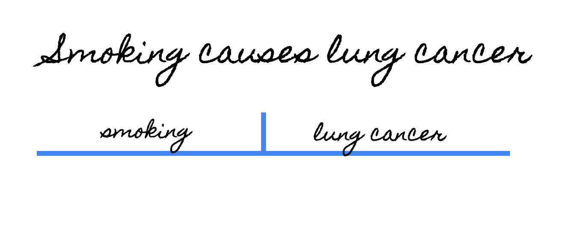

---

class: title title-1

# Diagramming a causal claim

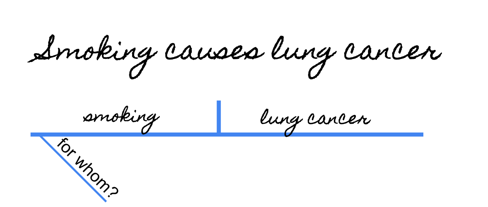

---

class: title title-1

# Diagramming a causal claim

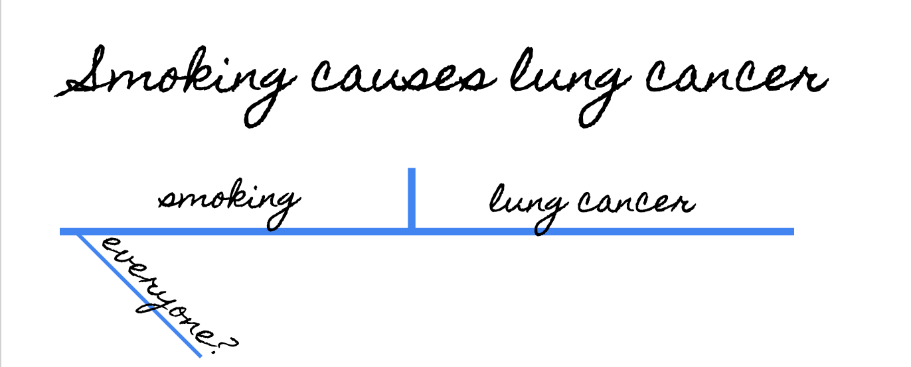

---

class: title title-1

# Diagramming a causal claim


---

class: title title-1

# Diagramming a causal claim

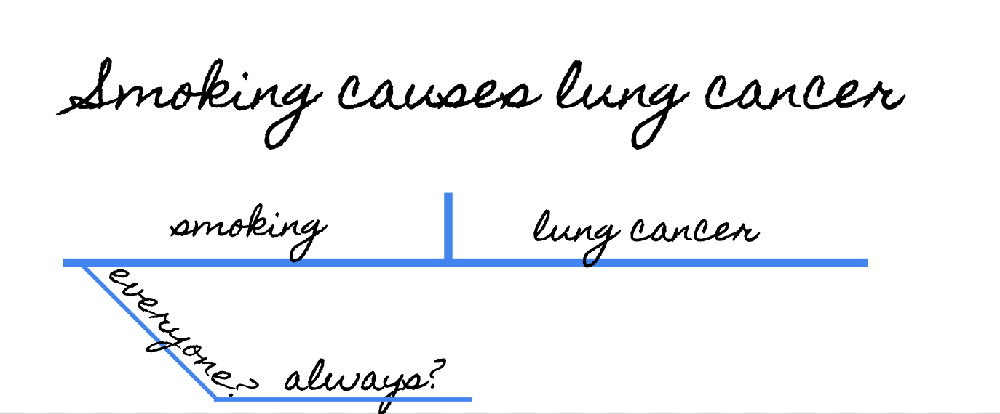

---


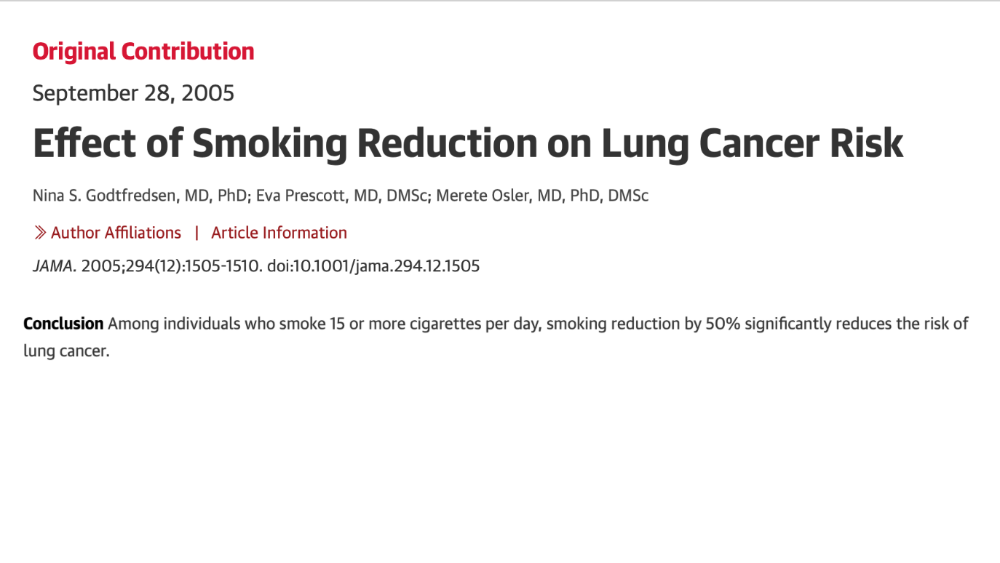

---


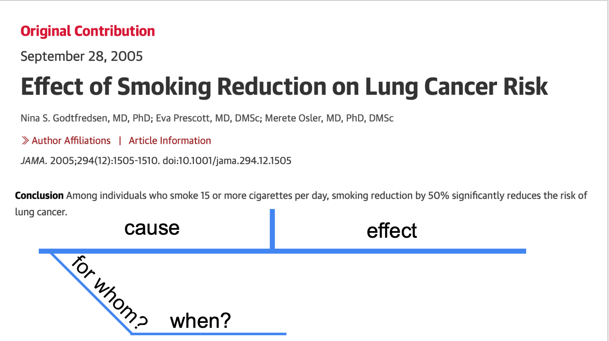

---


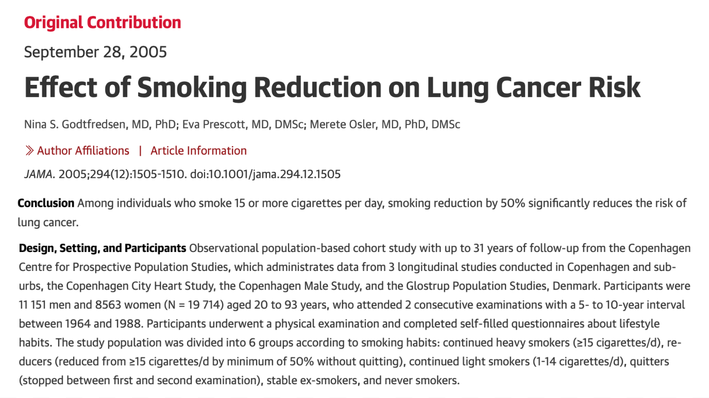

---


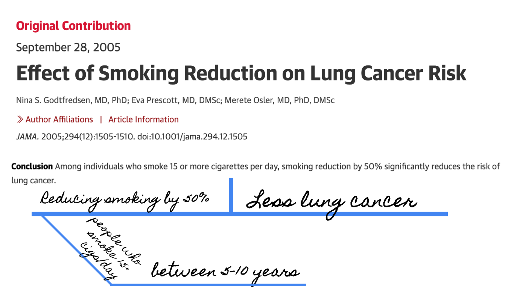

---

class: title title-1

# Asking good causal questions

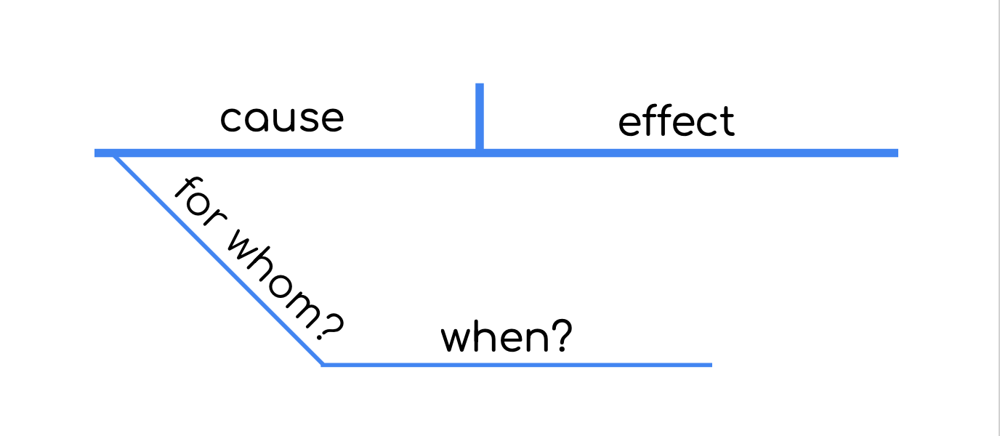


---

class: title title-1

# Asking good causal questions

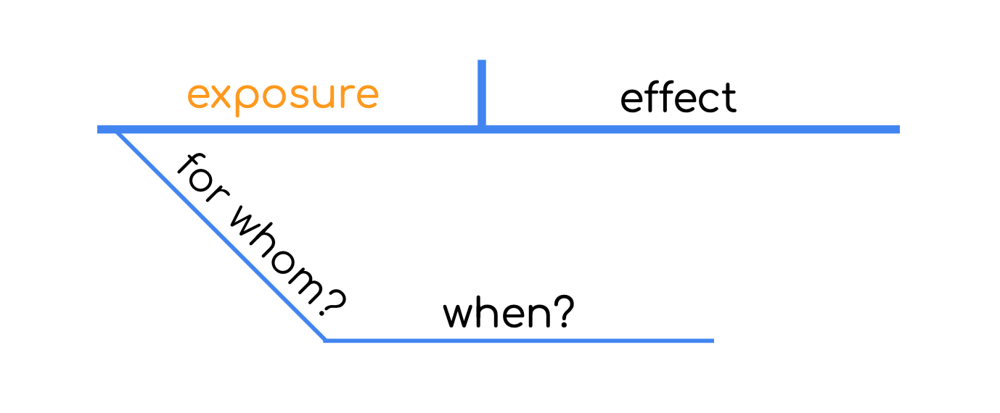

---

class: title title-1

# Asking good causal questions

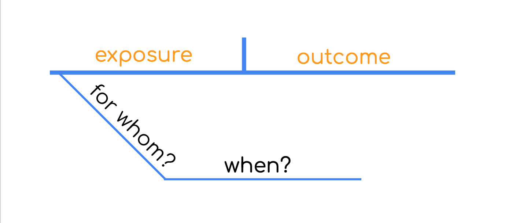

---

class: title title-1

# Asking good causal questions

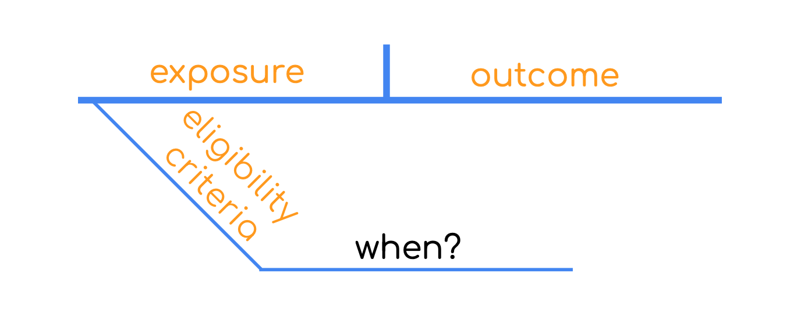

---

class: title title-1

# Asking good causal questions

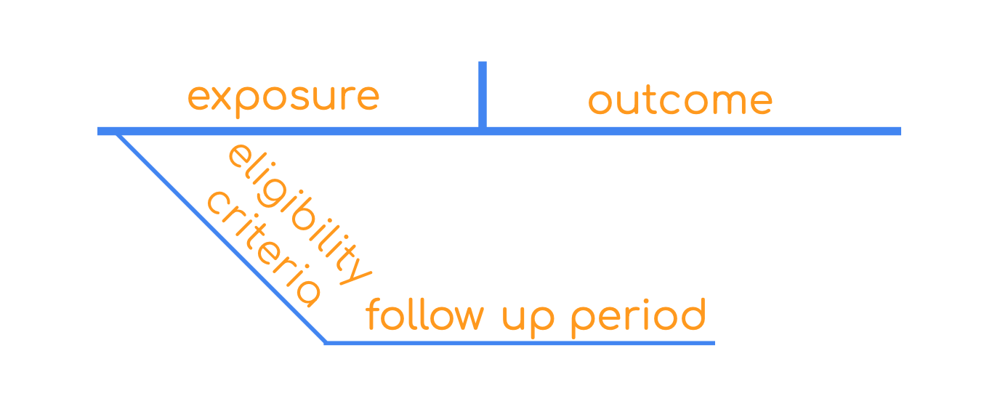

---

class: title title-1

# Asking good causal questions

.pull-left[

.box-inv-1.medium[the claim]

]


.pull-right[

.box-inv-1.medium[the evidence]

]

---

class: title title-1

# Asking good causal questions

.pull-left[

.box-inv-1.medium[the claim]
Smoking causes lung cancer
]


.pull-right[

.box-inv-1.medium[the evidence]

]

---
class: title title-1

# Asking good causal questions

.pull-left[

.box-inv-1.medium[the claim]
Smoking causes lung cancer
]


.pull-right[

.box-inv-1.medium[the evidence]
For people who smoking 15+cigarettes a day, reducing smoking by 50% reduces the risk of lung cancer over 5-10 years
]

--

.box-1.medium[do these match?]
--

.center[.huge[`r emo::ji("no_good_woman")`]]

---
class: title title-1

# Asking good causal questions

.pull-left[

.box-1.medium[the question]
Does smoking cause lung cancer?
]


.pull-right[

.box-inv-1.medium[the evidence]
For people who smoking 15+cigarettes a day, reducing smoking by 50% reduces the risk of lung cancer over 5-10 years
]


.box-1.medium[do these match?]

.center[.huge[`r emo::ji("no_good_woman")`]]
---

class: title title-1

# Asking good causal questions

.pull-left[

.box-inv-1.medium[the question]
For people who smoke 15+ cigarettes a day, does reducing smoking by 50% reduce the lung cancer risk over 5-10 years? 
]


.pull-right[

.box-inv-1.medium[the evidence]
For people who smoking 15+cigarettes a day, reducing smoking by 50% reduces the risk of lung cancer over 5-10 years
]


.box-1.medium[do these match?]

.center[.huge[`r emo::ji("raised_hands")`]]
---
class: title title-1, center

# `r fontawesome::fa("laptop")` Application Exercise
<br><br>

.huge[[bit.ly/sta-679-s22-ae3](https://bit.ly/sta-679-s22-ae3)]
