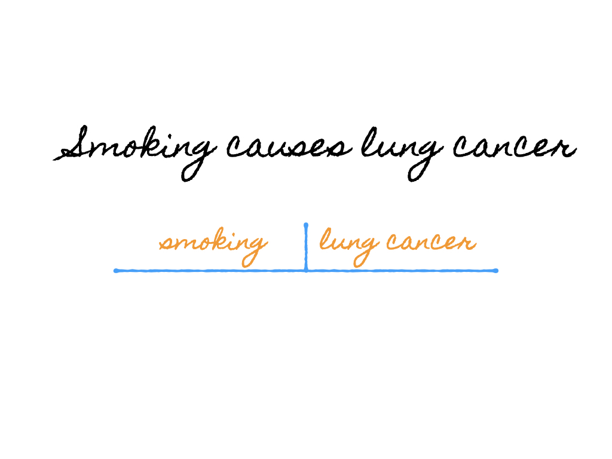
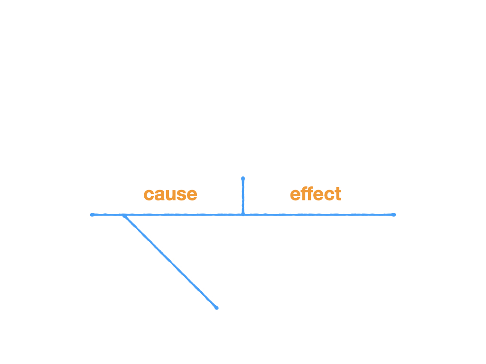
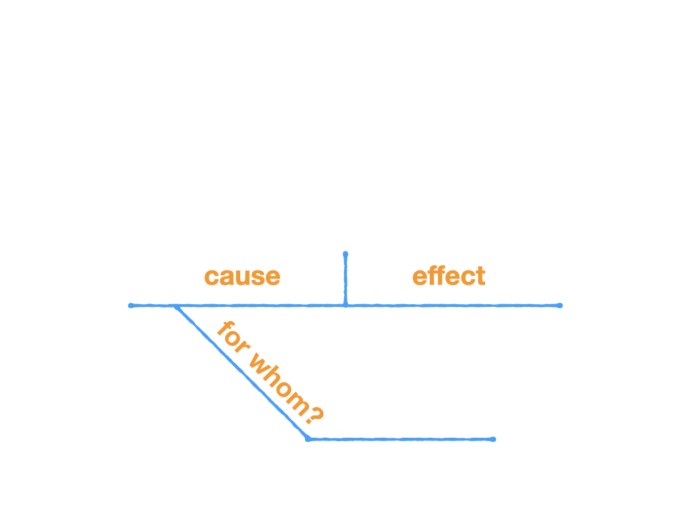
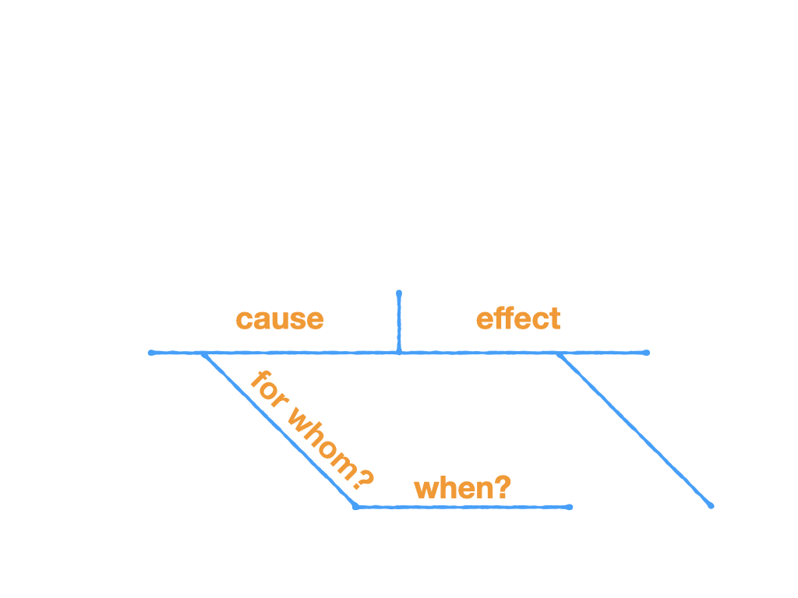
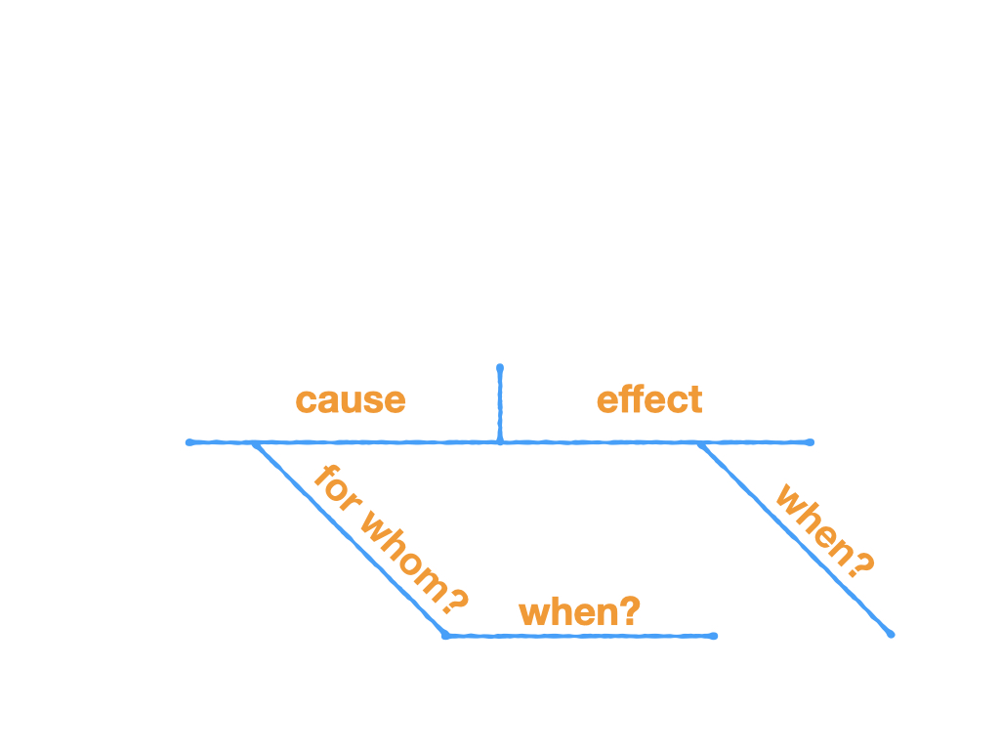
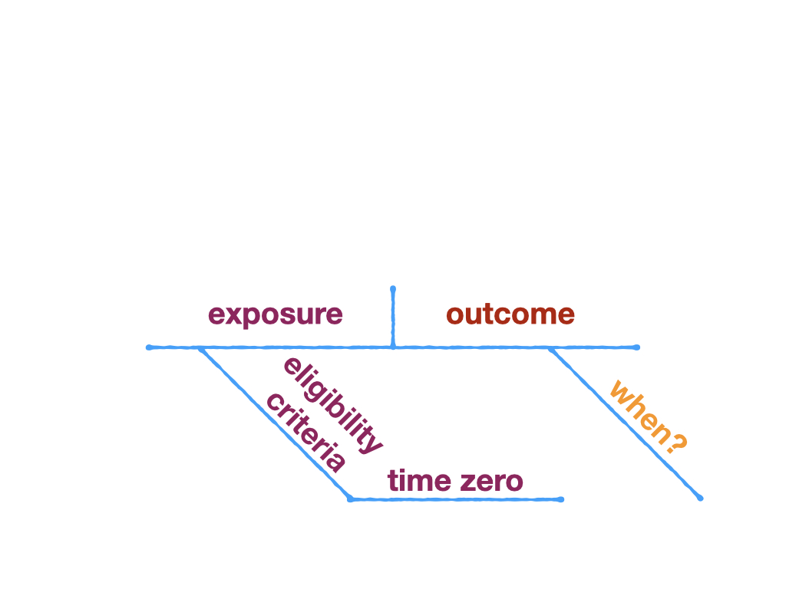
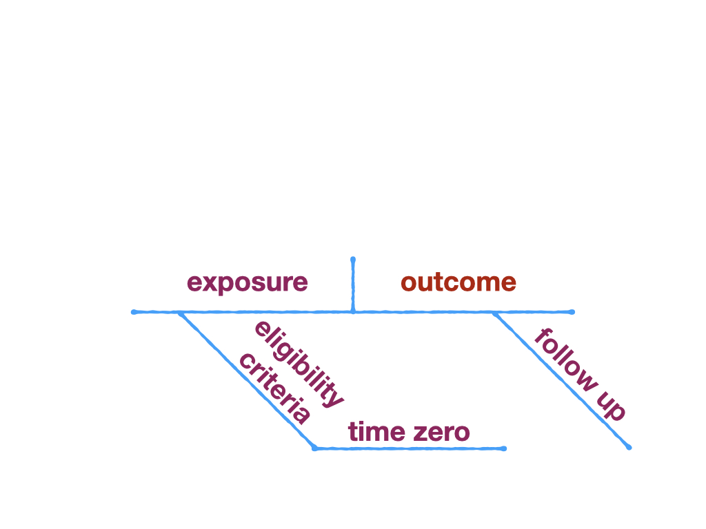
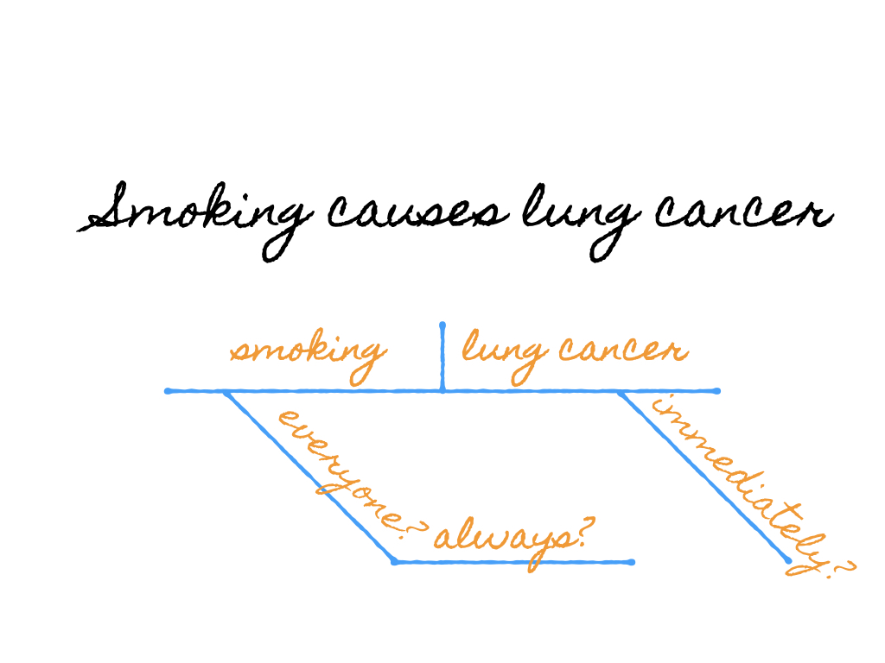

```{r setup, include=FALSE}
knitr::opts_chunk$set(warning = FALSE, message = FALSE, 
                      fig.retina = 3, fig.align = "center")
```


```{r xaringanExtra, echo=FALSE}
xaringanExtra::use_xaringan_extra(c("tile_view"))
```

class: center middle main-title section-title-1

# Target Trials

.class-info[

**Session 6**

.light[STA 379/679: Causal Inference <br>
Lucy D'Agostino McGowan
]

]

---

class: title title-1 center

# Potential Outcome

<br> <br>
.box-1[

What *will* happen to you in the future given you have a particular exposure

]  

<br>

--

.box-inv-1.medium[

**fixed** but **unknown**

]

---

class: title title-1

# Exposure assignment

.box-inv-1[Understanding the **assignment mechanism** is crucial for understanding the causal effect]

--

.box-1[Assignment probability must be **individualistic** (your covariates / potential outcomes can't influence my assignment)]

--

.box-1[All units must have **non-zero** probability for all exposures]

--

.box-1[Assignment **cannot** depend on the potential outcomes]

---

class: title title-1 

# What do we observe?


--

.box-1[

$Y_i^{obs}=Y_i(1)$ if $X_i=1$
]

<br>

--

.box-1[

$Y_i^{obs}=Y_i(0)$ if $X_i=0$
]

---

class: title title-1 

# What do we observe?

.box-1[
$Y_i^{obs}=Y_i(1)(X_i) + Y_i(0)(1-X_i)$
]

<br>

--

.box-inv-1[
Is $Y_{obs}$ independent of the exposure assignment, $X_i$?
]

---

class: title title-1

## Stable Unit Treatment Value Assumption

.box-inv-1[
The potential outcomes for any unit do not vary with the exposures assigned to other units, and, for each unit, there are no different forms or versions of each exposure level, which lead to different potential outcomes.]

.footer[
Imbens and Rubin (2015) *Causal Inference*
]

---

class: title title-1

## Summary of assumptions

.pull-left[
.box-1[**Potential outcomes** for any unit do not vary with the exposure of other units]
]

--

.pull-right[
.box-inv-1[`r emo::ji("speaking_head")` SUTVA [part 1]]
]

---

class: title title-1

## Summary of assumptions

.pull-left[
.box-1[**Potential outcomes** for any unit do not vary with the exposure of other units]
]

.pull-right[
.box-inv-1[`r emo::ji("speaking_head")` SUTVA [part 1]]

.box-inv-1[`r emo::ji("speaking_head")` no interference]
]

---

class: title title-1

## Summary of assumptions

.pull-left[
.box-1[**Potential outcomes** for any unit do not vary with the exposure of other units]
]

.pull-right[
.box-inv-1[`r emo::ji("speaking_head")` SUTVA [part 1]]

.box-inv-1[`r emo::ji("speaking_head")` no interference]

.box-inv-1[`r emo::ji("woman_scientist")` requires subject matter expertise]
]
---

class: title title-1

## Summary of assumptions

.pull-left[
.box-1[**Potential outcomes** for any unit do not vary with the exposure of other units]
]

.pull-right[
.box-inv-1[`r emo::ji("speaking_head")` SUTVA [part 1]]

.box-inv-1[`r emo::ji("speaking_head")` no interference]

.box-inv-1[`r emo::ji("woman_scientist")` requires subject matter expertise]

.box-inv-1[`r emo::ji("construction_worker")` can be resolved via study design]
]
---


class: title title-1

## Summary of assumptions

.pull-left[
.box-1[there are no different forms or versions of each exposure level]
]

--

.pull-right[

.box-inv-1[`r emo::ji("speaking_head")` SUTVA [part 2]]

]

---


class: title title-1

## Summary of assumptions

.pull-left[
.box-1[there are no different forms or versions of each exposure level]
]


.pull-right[

.box-inv-1[`r emo::ji("speaking_head")` SUTVA [part 2]]

.box-inv-1[`r emo::ji("speaking_head")` consistency]

]

---

class: title title-1

## Summary of assumptions

.pull-left[
.box-1[there are no different forms or versions of each exposure level]
]


.pull-right[

.box-inv-1[`r emo::ji("speaking_head")` SUTVA [part 2]]

.box-inv-1[`r emo::ji("speaking_head")` consistency]

.box-inv-1[`r emo::ji("woman_scientist")` clear definition of exposure]


]

---

class: title title-1

## Summary of assumptions

.pull-left[
.box-1[there are no different forms or versions of each exposure level]
]


.pull-right[

.box-inv-1[`r emo::ji("speaking_head")` SUTVA [part 2]]

.box-inv-1[`r emo::ji("speaking_head")` consistency]

.box-inv-1[`r emo::ji("woman_scientist")` clear definition of exposure]

.box-inv-1[`r emo::ji("construction_worker")` can be resolved via study design]

]
---

class: title title-1

## Summary of assumptions

.pull-left[
.box-1[**Exposure assignment** probability for any unit does not depend on covariates / potential outcomes of other units]
]

--

.pull-right[

.box-inv-1[`r emo::ji("speaking_head")` individualistic]

]

---

class: title title-1

## Summary of assumptions

.pull-left[
.box-1[**Exposure assignment** probability for any unit does not depend on covariates / potential outcomes of other units]
]


.pull-right[

.box-inv-1[`r emo::ji("speaking_head")` individualistic]

.box-inv-1[`r emo::ji("woman_scientist")` knowledge of assignment mechanism (violated in adaptive clinical trials)]

]
---

class: title title-1

## Summary of assumptions

.pull-left[
.box-1[**Exposure assignment** probability for any unit does not depend on covariates / potential outcomes of other units]
]


.pull-right[

.box-inv-1[`r emo::ji("speaking_head")` individualistic]

.box-inv-1[`r emo::ji("woman_scientist")` knowledge of assignment mechanism (violated in adaptive clinical trials)]

.box-inv-1[`r emo::ji("construction_worker")` classic randomization, non-sequential trials]

]

---
class: title title-1

## Summary of assumptions

.pull-left[
.box-1[All units must have **non-zero** probability for all exposures]
]

--
.pull-right[

.box-inv-1[`r emo::ji("speaking_head")` probabilistic]

.box-inv-1[`r emo::ji("speaking_head")` positivity]


]
---
class: title title-1

## Summary of assumptions

.pull-left[
.box-1[All units must have **non-zero** probability for all exposures]
]


.pull-right[

.box-inv-1[`r emo::ji("speaking_head")` probabilistic]

.box-inv-1[`r emo::ji("speaking_head")` positivity]

.box-inv-1[`r emo::ji("woman_scientist")` subject matter knowledge (structural violations), parameteric models (random violations)]


]
---
class: title title-1

## Summary of assumptions

.pull-left[
.box-1[All units must have **non-zero** probability for all exposures]
]


.pull-right[

.box-inv-1[`r emo::ji("speaking_head")` probabilistic]

.box-inv-1[`r emo::ji("speaking_head")` positivity]

.box-inv-1[`r emo::ji("woman_scientist")` subject matter knowledge (structural violations), parameteric models (random violations)]

.box-inv-1[`r emo::ji("construction_worker")` randomization]

]
---
class: title title-1

## Summary of assumptions

.pull-left[
.box-1[All units must have **non-zero** probability for all exposures]
]


.pull-right[

.box-inv-1[`r emo::ji("speaking_head")` probabilistic]

.box-inv-1[`r emo::ji("speaking_head")` positivity]

.box-inv-1[`r emo::ji("woman_scientist")` subject matter knowledge (structural violations), parameteric models (random violations)]

.box-inv-1[`r emo::ji("construction_worker")` randomization]

.box-inv-1[`r emo::ji("construction_worker")` exclusion criteria]
]

---
class: title title-1

## Summary of assumptions

.pull-left[
.box-1[Exposure assignment **cannot** depend on the potential outcomes]
]

--

.pull-right[

.box-inv-1[`r emo::ji("speaking_head")` no unmeasured confounding]


]
---

class: title title-1

## Summary of assumptions

.pull-left[
.box-1[Exposure assignment **cannot** depend on the potential outcomes]
]


.pull-right[

.box-inv-1[`r emo::ji("speaking_head")` no unmeasured confounding]

.box-inv-1[`r emo::ji("woman_scientist")` not testable :( (sensitivity analyses can help!)]


]
---
class: title title-1

## Summary of assumptions

.pull-left[
.box-1[Exposure assignment **cannot** depend on the potential outcomes]
]


.pull-right[

.box-inv-1[`r emo::ji("speaking_head")` no unmeasured confounding]

.box-inv-1[`r emo::ji("woman_scientist")` not testable :( (sensitivity analyses can help!)]

.box-inv-1[`r emo::ji("construction_worker")` randomization]

]
---
class: title title-1

## Summary of assumptions

.pull-left[
.box-1[Exposure assignment **cannot** depend on the potential outcomes]
]


.pull-right[

.box-inv-1[`r emo::ji("speaking_head")` no unmeasured confounding]

.box-inv-1[`r emo::ji("woman_scientist")` not testable :( (sensitivity analyses can help!)]

.box-inv-1[`r emo::ji("construction_worker")` randomization]

.box-inv-1[`r emo::ji("construction_worker")` condition on confounding factors to induce independence]

]

---

class: title title-1

# Summary of assumptions


Assumption | Classic Randomized Trial| Randomized Trial
------------|-----------------
No Interference | `r emo::ji("shrug")` | `r emo::ji("shrug")` 
Consistency | `r emo::ji("smile")` | `r emo::ji("smile")` 
Individualistic | `r emo::ji("smile")`| `r emo::ji("shrug")`
Probabilistic |`r emo::ji("smile")`| `r emo::ji("smile")`
Unconfounded |`r emo::ji("smile")`| `r emo::ji("shrug")`

---
class: title title-1

# Designing randomized trials
.footer[Hernán & Robins. (2016) American Journal of Epidemiology doi:10.1093/aje/kwv254]

.pull-left[
.box-inv-1.medium[eligibility criteria]

.box-inv-1.medium[consistent exposure]

.box-inv-1.medium[assignment procedures]

]
--
.pull-right[
.box-inv-1.medium[follow-up period]

.box-inv-1.medium[outcome]

.box-inv-1.medium[causal contrasts of interest]

.box-inv-1.medium[analysis plan]

]

---

class: title title-1

# Designing randomized trials
.footer[Hernán & Robins. (2016) American Journal of Epidemiology doi:10.1093/aje/kwv254]

.pull-left[
.box-inv-1.medium[eligibility criteria]

.box-inv-1.medium[consistent exposure]

.box-inv-1.medium[assignment procedures]

]

.pull-right[
.box-inv-1.medium[follow-up period]

.box-inv-1.medium[outcome]

.box-2.medium[causal contrasts of interest]

.box-2.medium[analysis plan]

]

---

class: title title-1 

# Summary of assumptions


Assumption | Eligibility Criteria | Consistent Exposure | Assignment Procedures | Follow-up Period | Outcome
------------|-----------------
No Interference | | `r emo::ji("heavy_check_mark")`|`r emo::ji("heavy_check_mark")` | | `r emo::ji("heavy_check_mark")`
Consistency | |`r emo::ji("heavy_check_mark")`|||
Individualistic | ||`r emo::ji("heavy_check_mark")`||
Probabilistic |`r emo::ji("heavy_check_mark")`||`r emo::ji("heavy_check_mark")`||
Unconfounded |`r emo::ji("heavy_check_mark")`||`r emo::ji("heavy_check_mark")`|`r emo::ji("heavy_check_mark")`||

---

class: title title-1

# Summary of assumptions


Assumption | Classic Randomized Trial| Randomized Trial| Observational Study
------------|-----------------|-------------------
No Interference | `r emo::ji("shrug")` | `r emo::ji("shrug")` | `r emo::ji("shrug")`
Consistency | `r emo::ji("smile")` | `r emo::ji("smile")` | `r emo::ji("shrug")`
Individualistic | `r emo::ji("smile")`| `r emo::ji("shrug")`| `r emo::ji("shrug")`
Probabilistic |`r emo::ji("smile")`| `r emo::ji("smile")`| `r emo::ji("shrug")`
Unconfounded |`r emo::ji("smile")`| `r emo::ji("shrug")`| `r emo::ji("shrug")`


---

class: title title-1 center

# Why not always conduct an experiment?

--
.box-1.medium[`r emo::ji("medical_symbol")` ethics ]

---

class: title title-1 center

# Why not always conduct an experiment?


.box-1.medium[`r emo::ji("medical_symbol")` ethics   `r emo::ji("money_with_wings")` money ]
---

class: title title-1 center

# Why not always conduct an experiment?


.box-1.medium[`r emo::ji("medical_symbol")` ethics   `r emo::ji("money_with_wings")` money  `r emo::ji("clock")` time ]


--

.box-inv-1.medium[Deferring a decision **is** a decision]

---

class: section-title-1 title-1 middle

# Target Trial

--

.box-inv-1[What experiment would you design if you could?]

---

class: title title-1

# Algorithm for causal inference

.pull-left[
.box-inv-1.medium[**Ask** good causal questions]
]
--

.pull-right[
.box-inv-1.medium[**Answer** the causal question]
]

.footer[Miguel Hernàn, Target Trials]

---

class: title title-1

# Algorithm for causal inference

.pull-left[
.box-inv-1.medium[**Ask** good causal questions]

.box-1[ Specify the protocol for a target trial]

]


.pull-right[
.box-inv-1.medium[**Answer** the causal question]
]


---

class: title title-1

# Algorithm for causal inference

.pull-left[
.box-inv-1.medium[**Ask** good causal questions]

.box-1[ Specify the protocol for a target trial]

]

.pull-right[
.box-inv-1.medium[**Answer** the causal question]

.box-1[Conduct the target trial if possible, OR]

.box-1[Use observational data to **emulate** the target trial]
]

.footer[Miguel Hernàn, Target Trials]
---

class: title title-1

# Compontents of a target trial

.pull-left[
.box-inv-1.medium[eligibility criteria]

.box-inv-1.medium[consistent exposure]

.box-inv-1.medium[assignment procedures]

]
--
.pull-right[
.box-inv-1.medium[follow-up period]

.box-inv-1.medium[outcome]

.box-inv-1.medium[causal contrasts of interest]

.box-inv-1.medium[analysis plan]

]

.footer[Hernán & Robins. (2016) American Journal of Epidemiology doi:10.1093/aje/kwv254]

---


class: title title-1

# Compontents of a target trial

.pull-left[
.box-inv-1.medium[eligibility criteria]

.box-inv-1.medium[consistent exposure]

.box-inv-1.medium[assignment procedures]

]

.pull-right[
.box-inv-1.medium[follow-up period]

.box-inv-1.medium[outcome]

.box-2.medium[causal contrasts of interest]

.box-2.medium[analysis plan]

]

.footer[Hernán & Robins. (2016) American Journal of Epidemiology doi:10.1093/aje/kwv254]

---

class: center middle

<figure>
</img>
</figure>

---

class: center middle

<figure>
</img>
</figure>
---

class: center middle

<figure>
</img>
</figure>

---

class: title title-1

# Compontents of a target trial

.pull-left[
.box-2.medium[eligibility criteria]

.box-inv-1.medium[consistent exposure]

.box-inv-1.medium[assignment procedures]

]

.pull-right[
.box-2.medium[follow-up period]

.box-2.medium[outcome]

.box-2.medium[causal contrasts of interest]

.box-2.medium[analysis plan]

]

.footer[Hernán & Robins. (2016) American Journal of Epidemiology doi:10.1093/aje/kwv254]

---


class: center middle

<figure>
</img>
</figure>

---

class: title title-1

# Compontents of a target trial

.pull-left[
.box-2.medium[eligibility criteria]

.box-2.medium[consistent exposure]

.box-2.medium[assignment procedures]

]

.pull-right[
.box-2.medium[follow-up period]

.box-inv-1.medium[outcome]

.box-2.medium[causal contrasts of interest]

.box-2.medium[analysis plan]

]

.footer[Hernán & Robins. (2016) American Journal of Epidemiology doi:10.1093/aje/kwv254]

---

class: center middle

<figure>
</img>
</figure>

---
class: center middle

<figure>
</img>
</figure>
---
class: center middle

<figure>
</img>
</figure>
---
class: center middle

<figure>
</img>
</figure>

---


class: title title-1

# Compontents of a target trial

.pull-left[
.box-inv-1.medium[eligibility criteria]

.box-2.medium[consistent exposure]

.box-2.medium[assignment procedures]

]

.pull-right[
.box-2.medium[follow-up period]

.box-2.medium[outcome]

.box-2.medium[causal contrasts of interest]

.box-2.medium[analysis plan]

]

.footer[Hernán & Robins. (2016) American Journal of Epidemiology doi:10.1093/aje/kwv254]

---

class: center middle

<figure>
</img>
</figure>

---

class: center middle

<figure>
</img>
</figure>
---

class: center middle

<figure>
</img>
</figure>

---

class: center middle

<figure>
</img>
</figure>

---

class: title title-1

# Compontents of a target trial

.pull-left[
.box-2.medium[eligibility criteria]

.box-2.medium[consistent exposure]

.box-2.medium[assignment procedures]

]

.pull-right[
.box-inv-1.medium[follow-up period]

.box-2.medium[outcome]

.box-2.medium[causal contrasts of interest]

.box-2.medium[analysis plan]

]

.footer[Hernán & Robins. (2016) American Journal of Epidemiology doi:10.1093/aje/kwv254]

---

class: center middle

<figure>
</img>
</figure>

---

class: center middle

<figure>
</img>
</figure>

---
class: center middle

<figure>
</img>
</figure>

---
class: center middle

<figure>
</img>
</figure>
---
class: center middle

<figure>
</img>
</figure>
---
class: center middle

<figure>
</img>
</figure>
---

class: title title-1

# An example

.pull-left[
.box-inv-1.medium[observational data]

* Women who used hormone replacement therapy had **lower risk** of heart disease compared to those who didn't
]

--

.pull-right[
.box-inv-1.medium[randomized trial]

* Women who were randomized to use hormone replacement therapy had **higher risk** of heart disease compared to those who didn't
]

.footer[Miguel Hernàn, Target Trials]

---
class: title title-1

# Why the difference?

.box-1[The randomized trial compared people who *started* treatment compared to those who didn't]

--

.box-inv-1[The observational trial compared *current* users; people who were susceptible to heart disease were already out of the cohort! So current use became a marker of not being susceptible]

.footer[Hernán et al. (2008) Epidemiology doi:10.1097/EDE.0b013e3181875e61]

---

class: title title-1

# The solution?

.box-inv-1[Reanalyze the observational data like the randomized trial (new users vs non users)]

.footer[Hernán et al. (2008) Epidemiology doi:10.1097/EDE.0b013e3181875e61]

---

class: title title-1

# The importance of time zero

.box-inv-1.medium[In a randomized study]

* Eligibility criteria are met
* Treatment is assigned
* Study outcomes begin to be recorded

--

.box-inv-1.medium[The same should be true for an observational study!]

---

class: title title-1

# What can go wrong?


.pull-left[ ]

.pull-right[.small[ [1] This can bias the effect estimate because the analysis is restricted to those who remained under follow-up by time zero (like the example!)]
]

.footer[Hernán et al (2016) Journal of Clinical Epidemiology doi: 10.1016/j.jclinepi.2016.04.014]
---

class: title title-1

# What can go wrong?


.pull-left[]

.pull-right[.small[ [2] This increases the opportunity for selection biasbecause the analysis will only include individuals who remain under follow-up at the reset time zero and who meet these posttreatment criteria]]

.footer[Hernán et al (2016) Journal of Clinical Epidemiology doi: 10.1016/j.jclinepi.2016.04.014]
---

class: title title-1

# What can go wrong?


.pull-left[]

.pull-right[.small[[3] Because treatment assignment predates eligibility, selection bias may arise (like 2). In addition, bias may also occur because by definition nobody would have an event between treatment assignment and the completion of the eligibility criteria. This is a period, often labeled as "immortal time", during which the risk is guaranteed to be exactly zero. ]]

.footer[Hernán et al (2016) Journal of Clinical Epidemiology doi: 10.1016/j.jclinepi.2016.04.014]
---

class: title title-1

# What can go wrong?


.pull-left[]
.pull-right[.small[[4] This bias occurs when information on treatment after time zero is used to assign individuals to a consistent exposure. ]]

.footer[Hernán et al (2016) Journal of Clinical Epidemiology doi: 10.1016/j.jclinepi.2016.04.014]

---

class: title-1 title

# Observational Study Target Trial

--

.box-1.medium[eligibility criteria]

--

.box-1.medium[consistent exposure]

--

.box-1.medium[follow-up time]

--

.box-1.medium[outcome]

--

.box-inv-1.medium[What is left?]

---

class: section-title-1 title-1 middle

# the only difference between an observational study and target randomized study should be the **exposure assignment procedures**

---

class: title title-1

# Exposure assignment

.box-inv-1[Understanding the **assignment mechanism** is crucial for understanding the causal effect]

--

.box-1[Assignment probability must be **individualistic** (your covariates / potential outcomes can't influence my assignment)]

--

.box-1[All units must have **non-zero** probability for all exposures]

--

.box-1[Assignment **cannot** depend on the potential outcomes]

---


class: title title-1

# Exposure assignment

.box-inv-1[Understanding the **assignment mechanism** is crucial for understanding the causal effect]


.box-2[Assignment probability must be **individualistic** (your covariates / potential outcomes can't influence my assignment)]

.box-2[All units must have **non-zero** probability for all exposures]

.box-1[Assignment **cannot** depend on the potential outcomes]

---

class:  title-inv-1

# Assignment **cannot** depend on the potential outcomes

.box-1.medium[

$\mathbf{Y}(1), \mathbf{Y}(0) \perp \mathbf{X}$
]

---
class: section-title-1 title-1 middle

# What if we could capture everything that causes this independence assumption to break?
---
class: section-title-1 title-1 middle

# confounders
---
class: section-title-1 title-1 middle

# confounders: all factors associated with both the potential outcomes and **X**
---

class:  title-inv-1

# Assignment **cannot** depend on the potential outcomes

.box-1.medium[

$\mathbf{Y}(1), \mathbf{Y}(0) \perp \mathbf{X}|\mathbf{Z}$
]

---
class: title title-1

```{r, echo = FALSE, message = FALSE, warning = FALSE}
library(tidyverse)
```

# Lucy Land Trial!

.small[
```{r, message = FALSE, warning = FALSE}
set.seed(1)

n <- 1000
meeple <- tibble(
  happy = sample(rep(c(1, 0), each = n / 2)),
  happiness = case_when(
    happy == 1 ~ rbinom(n, 5, 0.7),
    happy == 0 ~ rbinom(n, 3, 0.2)
  ),
  y0 = happiness,
  y1 = happiness
)
```
]
---

class: title title-1

# Lucy Land Trial!

```{r}
set.seed(5)

d_lucy <- meeple %>%
  mutate(x = case_when(
    happy == 1 ~ rbinom(n, 1, 0.9), 
    happy == 0 ~ rbinom(n, 1, 0.1) 
  ), 
  y_obs = ifelse(x == 1, y1, y0))

```

---


class: title title-1

# Lucy Land Trial!

```{r}
set.seed(5)

d_lucy <- meeple %>%
  mutate(x = case_when( #<<
    happy == 1 ~ rbinom(n, 1, 0.9), #<<
    happy == 0 ~ rbinom(n, 1, 0.1) #<<
  ),#<<
  y_obs = ifelse(x == 1, y1, y0))

```

.box-inv-1[What does this violate?]

---
class: section-title-1 title-1 middle

# the baseline indicator `happy` is a confounder for the exposure (getting ice cream based on whether they `smile`) and the outcome (`happiness`)
---

class: title title-1

# Confounding

```{r, echo = FALSE}
library(ggdag)
coord_dag <- list(
  x = c(Happy = 0, y = 1, x = 1),
  y = c(Happy = 0.5, y = 1, x = 0)
)
labels <- c(
  x = "Lucy Gives Ice Cream",
  y = "Happiness",
  Happy = "Baseline happiness"
)
dagify(
  y ~ Happy,
  x ~ Happy,
  coords = coord_dag,
  labels = labels
) %>%
  ggdag(use_labels = "label", text = FALSE, text_size = 9, node_size = 30) +
  geom_dag_edges(edge_colour = "light blue", edge_width = 2) +
  theme_dag()
```

---

class: title title-1

# Lucy Land Trial!

.small[
```{r}
d_lucy %>%
  summarise(true_causal_effect = mean(y1) - mean(y0))
```
]
--

.box-inv-1[
$\bar{Y}(1) - \bar{Y}(0)$
]
---
class: title title-1

# Lucy Land Trial!

.small[
```{r}
d_lucy %>%
  summarise(observed_causal_effect = 
              sum(y_obs * x) / sum(x) -
              sum(y_obs * (1 - x)) / sum(1 - x))
```
]
---
class: title title-1

# Lucy Land Trial!

.small[
```{r}
d_lucy %>%
  summarise(observed_causal_effect = 
              sum(y_obs * x) / sum(x) - #<<
              sum(y_obs * (1 - x)) / sum(1 - x))
```
]

.box-inv-1.medium[

$\bar{Y}^{obs}_e$
]
---

class: title title-1

# Lucy Land Trial!

.small[
```{r}
d_lucy %>%
  summarise(observed_causal_effect = 
              sum(y_obs * x) / sum(x) - 
              sum(y_obs * (1 - x)) / sum(1 - x)) #<<
```
]

.box-inv-1.medium[

$\bar{Y}^{obs}_c$
]

---

class: title title-1

# Lucy Land Trial!


.small[
```{r}
d_lucy %>%
  group_by(happy) %>%
  summarise(observed_causal_effect = 
              sum(y_obs * x) / sum(x) - 
              sum(y_obs * (1 - x)) / sum(1 - x))
```
]

---

class: title title-1

# Lucy Land Trial!


.small[
```{r}
d_lucy %>%
  group_by(happy) %>% #<<
  summarise(observed_causal_effect = 
              sum(y_obs * x) / sum(x) - 
              sum(y_obs * (1 - x)) / sum(1 - x))
```
]


.box-inv-1[Why did this work?]

---

class: title title-1

# Lucy Land Trial!


.small[
```{r}
d_lucy %>%
  group_by(happy) %>% #<<
  summarise(observed_causal_effect = 
              sum(y_obs * x) / sum(x) - 
              sum(y_obs * (1 - x)) / sum(1 - x))
```
]


.box-inv-1[After conditioning on `happy`, `x` is independent of the potential outcomes]
---


class: section-title-1 title-1 middle

# the only difference between an observational study and target randomized study should be the **exposure assignment procedures**

---

class: section-title-1 title-1 middle

# what if we have several confounders?

---

class: title title-1

# Lucy Land Trial!


.small[
```{r}
d_lucy %>%
  group_by(happy) %>%
  summarise(observed_causal_effect = 
              sum(y_obs * x) / sum(x) - 
              sum(y_obs * (1 - x)) / sum(1 - x))
```
]

---

class: title title-1

# Lucy Land Trial!

```{r, eval = FALSE}
p <- glm(x ~ happy, data = d_lucy, family = binomial()) %>%
  predict(type = "response")

d_lucy <- d_lucy %>%
  mutate(prob_of_exposure = p)
```

---

class: title title-1

# Lucy Land Trial!

```{r, eval = FALSE}
p <- glm(x ~ happy, data = d_lucy, family = binomial()) %>%#<<
  predict(type = "response")#<<

d_lucy <- d_lucy %>%
  mutate(prob_of_exposure = p)
```


---

class: title title-1

# Lucy Land Trial!

```{r}
p <- glm(x ~ happy, data = d_lucy, family = binomial()) %>%
  predict(type = "response")

d_lucy <- d_lucy %>% #<<
  mutate(prob_of_exposure = p)#<<
```

--

.box-inv-1[Estimate the probability of being "assigned" to the exposure]

---
class: title title-1

# Lucy Land Trial!

.small[
```{r}
d_lucy
```

]

---
class: title title-1

# Lucy Land Trial!

```{r}
d_lucy %>%
  mutate(wt = x / p + (1 - x) / (1 - p)) %>%
  summarise(observed_causal_effect = 
              sum(y_obs * x * wt) / sum(x * wt) - 
              sum(y_obs * (1 - x) * wt) / sum((1 - x) * wt))
```
---
class: title title-1

# Lucy Land Trial!

```{r}
d_lucy %>%
  mutate(wt = x / p + (1 - x) / (1 - p)) %>% #<<
  summarise(observed_causal_effect = 
              sum(y_obs * x * wt) / sum(x * wt) - 
              sum(y_obs * (1 - x) * wt) / sum((1 - x) * wt)) 
```
---

class: title title-1

# Lucy Land Trial!

```{r}
d_lucy %>%
  mutate(wt = x / p + (1 - x) / (1 - p)) %>%
  summarise(observed_causal_effect = 
              sum(y_obs * x * wt) / sum(x * wt) -  #<<
              sum(y_obs * (1 - x) * wt) / sum((1 - x) * wt)) #<<
```

---

class: section-title-1 title-1 middle

# If you can condition on all confounders, you can regain an exposure assignment independent of the potential outcomes `r emo::ji("muscle")`

---
