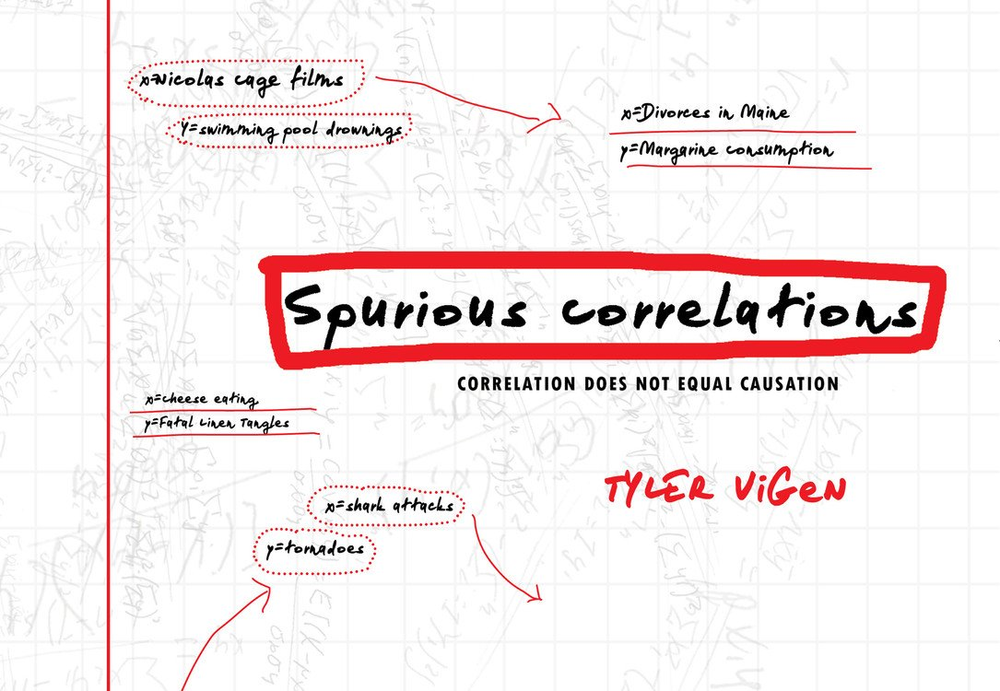

```{r setup, include=FALSE}
knitr::opts_chunk$set(warning = FALSE, message = FALSE, 
                      fig.retina = 3, fig.align = "center")
```


```{r xaringanExtra, echo=FALSE}
xaringanExtra::use_xaringan_extra(c("tile_view"))
```

class: center middle main-title section-title-1

# Causal Diagrams

.class-info[

**Session 7**

.light[STA 379/679: Causal Inference <br>
Lucy D'Agostino McGowan
]

]

---
class: center

</img>

---

class: title title-1

# What causes spurious correlations?

1. Random chance

---


class: title title-1

# What causes spurious correlations?

1. Random chance
1. Confounders

---

class: title title-1

# How do we correct for these?

.pull-left[
.box-inv-1[Random chance]
]

---
class: title title-1

# How do we correct for these?

.pull-left[
.box-inv-1[Random chance]

.box-1[Classic statistics!]
]
---
class: title title-1

# How do we correct for these?

.pull-left[
.box-inv-1[Random chance]

.box-1[Classic statistics!]

.box-1[Measures of uncertainty (i.e.confidence intervals)]
]

---



.footer[https://www.tylervigen.com/spurious-correlations]

---


---

```{r, include = FALSE}
library(tidyverse)
```

.small[
```{r}
d <- tibble(
  year = 1999:2009,
  nic_cage = c(2, 2, 2, 3, 1, 1, 2, 3, 4, 1, 4),
  drownings = c(109, 102, 102, 98, 85, 95, 96, 98, 123, 94, 102),
)

cor.test(~ nic_cage + drownings, data = d)
```
]

---

.small[
```{r, highlight.output = 8}
d <- tibble(
  year = 1999:2009,
  nic_cage = c(2, 2, 2, 3, 1, 1, 2, 3, 4, 1, 4),
  drownings = c(109, 102, 102, 98, 85, 95, 96, 98, 123, 94, 102),
)

cor.test(~ nic_cage + drownings, data = d)
```
]

---

class: title title-1

# How do we correct for these?

.pull-left[
.box-inv-1[Random chance]

.box-1[Classic statistics!]

.box-1[Measures of uncertainty (i.e.confidence intervals)]
]

.pull-right[
.box-inv-1[Confounders]
]

---

class: title title-1

# How do we correct for these?

.pull-left[
.box-inv-1[Random chance]

.box-1[Classic statistics!]

.box-1[Measures of uncertainty (i.e.confidence intervals)]
]

.pull-right[
.box-inv-1[Confounders]

.box-1[adjust for confounders!]
]

---


---

.small[
```{r}

d <- tibble(
  year = 2000:2009,
  bedsheets = c(327, 456, 509, 497, 596, 573, 661, 741, 809, 717),
  cheese = c(29.8, 30.1, 30.5, 30.6, 31.3, 31.7, 32.6, 33.1, 32.7, 32.8),
)
cor.test(~bedsheets + cheese, data = d)
```
]

---

.small[
```{r, highlight.output = 8}

d <- tibble(
  year = 2000:2009,
  bedsheets = c(327, 456, 509, 497, 596, 573, 661, 741, 809, 717),
  cheese = c(29.8, 30.1, 30.5, 30.6, 31.3, 31.7, 32.6, 33.1, 32.7, 32.8),
)
cor.test(~bedsheets + cheese, data = d)
```
]
---

class: title title-1

# Confounder: time

.pull-left[
```{r, echo = FALSE}
acf(d$cheese, main = "Autocorrelation Cheese Consumption")
```
]

--

.pull-right[
```{r, echo = FALSE}
acf(d$bedsheets, main = "Autocorrelation Bedsheet Tangling")
```
]
---

.small[
```{r}

d <- tibble(
  year = 2000:2009,
  bedsheets = c(327, 456, 509, 497, 596, 573, 661, 741, 809, 717),
  cheese = c(29.8, 30.1, 30.5, 30.6, 31.3, 31.7, 32.6, 33.1, 32.7, 32.8),
  bedsheets_ind = bedsheets - lag(bedsheets), #<<
  cheese_ind = cheese - lag(cheese) #<<
)
cor.test(~bedsheets_ind + cheese_ind, data = d)
```
]
---
.small[
```{r, highlight.output = c(5, 8)}

d <- tibble(
  year = 2000:2009,
  bedsheets = c(327, 456, 509, 497, 596, 573, 661, 741, 809, 717),
  cheese = c(29.8, 30.1, 30.5, 30.6, 31.3, 31.7, 32.6, 33.1, 32.7, 32.8),
  bedsheets_ind = bedsheets - lag(bedsheets),
  cheese_ind = cheese - lag(cheese)
)
cor.test(~bedsheets_ind + cheese_ind, data = d)
```
]
---

class: title title-1

# Causal Diagrams

.box-1[Visual depiction of causal relationships]

--

.box-1[Shows variables (nodes) and relationships (edges)]

--

.box-1[Time goes left to right]

--

.box-1[An arrow from one variable to another indicates a direct causal effect]

---
class: title title-1

# Causal Diagrams

```{r, echo = FALSE, message = FALSE, warning = FALSE}
library(ggdag)
library(ggplot2)
coord_dag <- list(
  x = c(z = 1, y = 3, x = 2),
  y = c(z = 1, y = 1, x = 1)
)
labels <- c(
  x = "Exposure",
  y = "Outcome",
  z = "Confounder"
)
dagify(
  y ~ z,
  x ~ z,
  coords = coord_dag,
  labels = labels
) %>%
  ggplot(aes(x = x, y = y, xend = xend, yend = yend)) +
  geom_dag_edges_arc(edge_colour = "light blue", edge_width = 2, curvature = c(0, 0.5)) +
  geom_dag_point() +
  geom_dag_text(size = 10) +
  theme_dag() + 
  ylim(0, 2)
```

---

class: title title-1

# Causal Diagrams: DAGs


.pull-left-3[

.box-inv-1.medium[directed]


]

--

.pull-middle-3[

.box-inv-1.medium[acyclic]


]

--

.pull-right-3[

.box-inv-1.medium[graph]


]
---

class: title title-1

# Causal Diagrams: DAGs


.pull-left-3[

.box-inv-1.medium[directed]

.box-1[edges imply direction (arrows)]

]


.pull-middle-3[

.box-inv-1.medium[acyclic]


]


.pull-right-3[

.box-inv-1.medium[graph]


]
---

class: title title-1

# Causal Diagrams: DAGs


.pull-left-3[

.box-inv-1.medium[directed]

.box-1[edges imply direction (arrows)]

]


.pull-middle-3[

.box-inv-1.medium[acyclic]

.box-1[no variables can "cause" themselves, thus there are no *cycles*]
]


.pull-right-3[

.box-inv-1.medium[graph]


]
---


class: title title-1

# Causal Diagrams: DAGs


.pull-left-3[

.box-inv-1.medium[directed]

.box-1[edges imply direction (arrows)]

]


.pull-middle-3[

.box-inv-1.medium[acyclic]

.box-1[no variables can "cause" themselves, thus there are no *cycles*]
]


.pull-right-3[

.box-inv-1.medium[graph]

.box-1[it's a graph!]
]
---

class: section-title section-title-1 middle 

# "Draw your assumptions before your conclusions" 
## -- Miguel Hernán
---
class: title-1 title

# Drawing causal diagrams

1. Specify your causal question


.footer[
Barrett & D'Agostino McGowan *Causal Inference Workshop* https://causal-inference-r-workshop.netlify.app
]

---

class: title-1 title

# Drawing causal diagrams

1. Specify your causal question
1. Use domain knowledge

.footer[
Barrett & D'Agostino McGowan *Causal Inference Workshop* https://causal-inference-r-workshop.netlify.app
]

---

class: title-1 title

# Drawing causal diagrams

1. Specify your causal question
1. Use domain knowledge
1. Write variables as nodes

.footer[
Barrett & D'Agostino McGowan *Causal Inference Workshop* https://causal-inference-r-workshop.netlify.app
]

---

class: title-1 title

# Drawing causal diagrams

1. Specify your causal question
1. Use domain knowledge
1. Write variables as nodes
1. Write causal pathways as arrows (edges)

.footer[
Barrett & D'Agostino McGowan *Causal Inference Workshop* https://causal-inference-r-workshop.netlify.app
]

---

class: title title-1

# Specify your causal question

.box-inv-1.medium[Does listening to a comedy podcast the morning before an exam improve graduate students test scores?]

---

class: title title-1 center

# Specify your causal question

</img>

---


class: title title-1 center

# Specify your causal question

</img>

---

class: title title-1 

# Use domain knowledge

.pull-left[
.box-1[What are all of the things that could "cause" you to listen to a comedy podcast]
]
--

.pull-right[
.box-1[What are all of the things that could "cause" you to do well on a test]
]
---

class: title title-1 center

# `r fontawesome::fa("laptop")` Application Exercise

<br><br><br>

## [bit.ly/sta-679-s22-ae6](https://bit.ly/sta-679-s22-ae6)

---

class: section-title section-title-1 middle

# install.packages("ggdag")

---

class: title title-1

# Specify your DAG

```{r, eval = FALSE}
library(ggdag)
dagify(
  podcast ~ mood + humor + prepared,
  exam ~ mood + prepared,
  exposure = "podcast",
  outcome = "exam"
) %>%
  ggdag() + 
  theme_dag()
```

---
class: title title-1

# Specify your DAG

```{r, eval = FALSE}
library(ggdag)
dagify(
  podcast ~ mood + humor + prepared, #<<
  exam ~ mood + prepared,
  exposure = "podcast",
  outcome = "exam"
) %>%
  ggdag() + 
  theme_dag()
```

---
class: title title-1


# Specify your DAG

```{r, eval = FALSE}
library(ggdag)
dagify(
  podcast ~ mood + humor + prepared,
  exam ~ mood + prepared, #<<
  exposure = "podcast",
  outcome = "exam"
) %>%
  ggdag() + 
  theme_dag()
```

---
class: title title-1

# Specify your DAG

```{r, eval = FALSE}
library(ggdag)
dagify(
  podcast ~ mood + humor + prepared,
  exam ~ mood + prepared,
  exposure = "podcast", #<<
  outcome = "exam"
) %>%
  ggdag() + 
  theme_dag()
```

---
class: title title-1

# Specify your DAG

```{r, eval = FALSE}
library(ggdag)
dagify(
  podcast ~ mood + humor + prepared,
  exam ~ mood + prepared,
  exposure = "podcast",
  outcome = "exam" #<<
) %>%
  ggdag() + 
  theme_dag()
```

---

class: title title-1

# Specify your DAG

```{r, eval = FALSE}
library(ggdag)
dagify(
  podcast ~ mood + humor + prepared,
  exam ~ mood + prepared,
  exposure = "podcast",
  outcome = "exam"
) %>%
  ggdag() +  #<<
  theme_dag()
```

--

.box-1[Note, we haven't ordered this by time yet, we'll deal with that in a bit!]

---

class: title title-1

# Specify your DAG

```{r, echo = FALSE}
library(ggdag)
dagify(
  podcast ~ mood + humor + prepared,
  exam ~ mood + prepared,
  exposure = "podcast",
  outcome = "exam"
) %>%
  ggdag(node_size = 30) +  
  geom_dag_edges(edge_colour = "light blue", edge_width = 2) +
  theme_dag()
```

---

class: title title-1

# Spurious causal effect?

.box-inv-1.medium[Backdoor paths]

--

.box-1[Causal paths that point into both the "exposure" node and "outcome" node]

--

.box-1[If the experiment is randomized, there are no backdoor paths from the exposure to outcome]

--

.box-1[Otherwise, we can *condition* on measured covariates in order to blog all backdoor paths]

---

class: title title-1

# Eliminate backdoor paths

```{r, eval = FALSE}
dagify(
  podcast ~ mood + humor + prepared,
  exam ~ mood + prepared,
  exposure = "podcast",
  outcome = "exam"
) %>%
  ggdag_paths()
```

---


class: title title-1

# Eliminate backdoor paths

```{r, eval = FALSE}
dagify(
  podcast ~ mood + humor + prepared,
  exam ~ mood + prepared,
  exposure = "podcast",
  outcome = "exam"
) %>%
  ggdag_paths() #<<
```

---


class: title title-1

# Eliminate backdoor paths

.pull-left[
```{r, echo = FALSE}
dagify(
  podcast ~ mood + humor + prepared,
  exam ~ mood + prepared,
  exposure = "podcast",
  outcome = "exam"
) %>%
  ggdag_paths(node_size = 20)
```
]
--
.pull-right[
.box-1[What isn't here? Why?]
]
---

class: title title-1

# Identify adjustment sets

```{r, eval = FALSE}
dagify(
  podcast ~ mood + humor + prepared,
  exam ~ mood + prepared,
  exposure = "podcast",
  outcome = "exam"
) %>%
  ggdag_adjustment_set()
```

---

class: title title-1

# Identify adjustment sets

```{r, eval = FALSE}
dagify(
  podcast ~ mood + humor + prepared,
  exam ~ mood + prepared,
  exposure = "podcast",
  outcome = "exam"
) %>%
  ggdag_adjustment_set() #<<
```

---

class: title title-1

# Identify adjustment sets

```{r, echo = FALSE}
dagify(
  podcast ~ mood + humor + prepared,
  exam ~ mood + prepared,
  exposure = "podcast",
  outcome = "exam"
) %>%
  ggdag_adjustment_set(node_size = 20)
```

---

class: title title-1

# Time order

```{r, eval = FALSE, message = FALSE, warning = FALSE}
coord_dag <- list(
  x = c(mood = 1, prepared = 1, podcast = 2, exam = 3),
  y = c(mood = 0.5, prepared = 1.5, podcast = 1, exam = 1)
)

dagify(
  podcast ~ prepared + mood ,
  exam ~ prepared + mood,
  coords = coord_dag
) %>%
  ggdag() +
  theme_dag()
```

---
class: title title-1
# Time order

```{r, eval = FALSE, message = FALSE, warning = FALSE}
coord_dag <- list( #<<
  x = c(mood = 1, prepared = 1, podcast = 2, exam = 3), 
  y = c(mood = 0.5, prepared = 1.5, podcast = 1, exam = 1) 
) #<<

dagify(
  podcast ~ prepared + mood ,
  exam ~ prepared + mood,
  coords = coord_dag
) %>%
  ggdag() +
  theme_dag()
```

---

class: title title-1
# Time order

```{r, eval = FALSE, message = FALSE, warning = FALSE}
coord_dag <- list( 
  x = c(mood = 1, prepared = 1, podcast = 2, exam = 3),  #<<
  y = c(mood = 0.5, prepared = 1.5, podcast = 1, exam = 1) 
) 

dagify(
  podcast ~ prepared + mood ,
  exam ~ prepared + mood,
  coords = coord_dag
) %>%
  ggdag() +
  theme_dag()
```

---

class: title title-1
# Time order

```{r, eval = FALSE, message = FALSE, warning = FALSE}
coord_dag <- list( 
  x = c(mood = 1, prepared = 1, podcast = 2, exam = 3), 
  y = c(mood = 0.5, prepared = 1.5, podcast = 1, exam = 1)  #<<
) 

dagify(
  podcast ~ prepared + mood ,
  exam ~ prepared + mood,
  coords = coord_dag
) %>%
  ggdag() +
  theme_dag()
```

---

class: title title-1
# Time order

```{r, eval = FALSE, message = FALSE, warning = FALSE}
coord_dag <- list( 
  x = c(mood = 1, prepared = 1, podcast = 2, exam = 3), 
  y = c(mood = 0.5, prepared = 1.5, podcast = 1, exam = 1) 
) 

dagify(
  podcast ~ prepared + mood ,
  exam ~ prepared + mood,
  coords = coord_dag #<<
) %>%
  ggdag() +
  theme_dag()
```

---

class: title title-1
# Time order

```{r, echo = FALSE, message = FALSE, warning = FALSE}
coord_dag <- list( 
  x = c(mood = 1, prepared = 1, podcast = 2, exam = 3), 
  y = c(mood = 0.5, prepared = 1.5, podcast = 1, exam = 1) 
) 

dagify(
  podcast ~ prepared + mood ,
  exam ~ prepared + mood,
  coords = coord_dag
) %>%
  ggdag(node_size = 20) +
  theme_dag()
```


