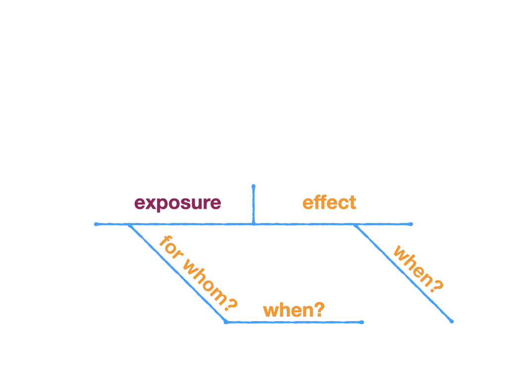
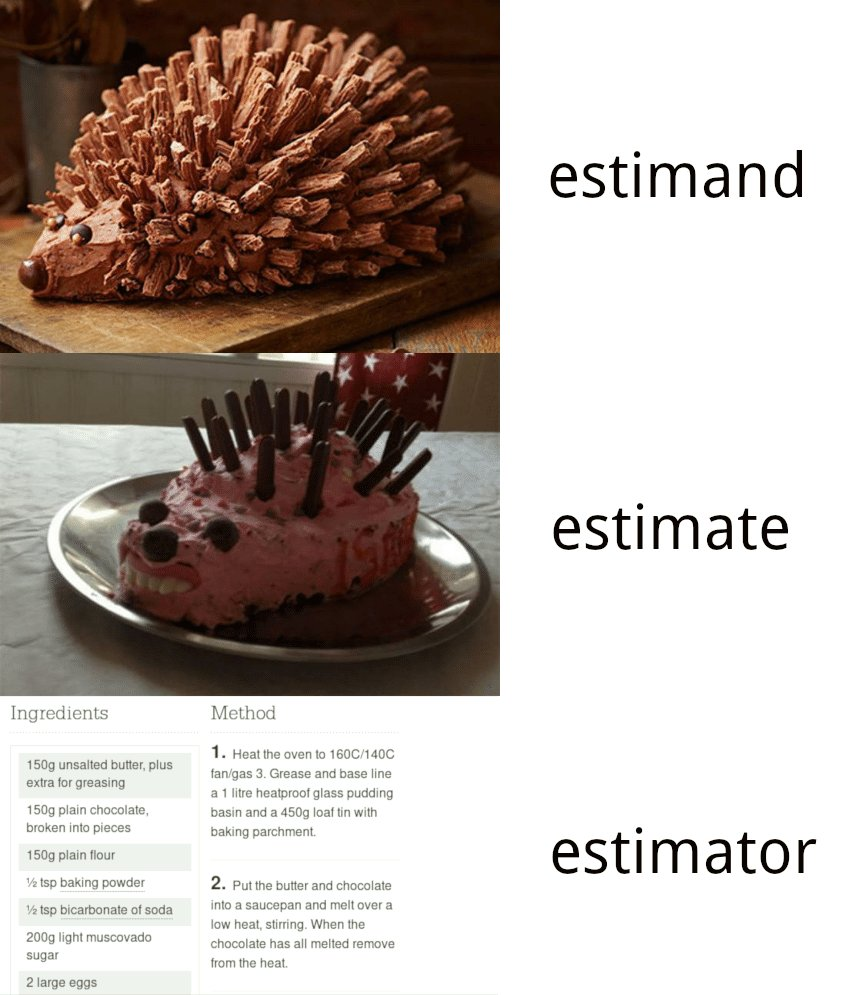

```{r setup, include=FALSE}
knitr::opts_chunk$set(warning = FALSE, message = FALSE, 
                      fig.retina = 3, fig.align = "center")
```


```{r xaringanExtra, echo=FALSE}
xaringanExtra::use_xaringan_extra(c("tile_view"))
```

class: center middle main-title section-title-1

# Review

.class-info[

**Session 13**

.light[STA 379/679: Causal Inference <br>
Lucy D'Agostino McGowan
]

]

---


---
class: title title-1

# Asking good causal questions

.pull-left[

.box-inv-1.medium[the claim]

]


.pull-right[

.box-inv-1.medium[the evidence]

]

---

class: title title-1

# Asking good causal questions

.pull-left[

.box-inv-1.medium[the claim]
Smoking causes lung cancer
]


.pull-right[

.box-inv-1.medium[the evidence]

]

---
class: title title-1

# Asking good causal questions

.pull-left[

.box-inv-1.medium[the claim]
Smoking causes lung cancer
]


.pull-right[

.box-inv-1.medium[the evidence]
For people who smoking 15+cigarettes a day, reducing smoking by 50% reduces the risk of lung cancer over 5-10 years
]

--

.box-1.medium[do these match?]
--

.center[.huge[`r emo::ji("no_good_woman")`]]

---
class: title title-1

# Asking good causal questions

.pull-left[

.box-1.medium[the question]
Does smoking cause lung cancer?
]


.pull-right[

.box-inv-1.medium[the evidence]
For people who smoking 15+cigarettes a day, reducing smoking by 50% reduces the risk of lung cancer over 5-10 years
]


.box-1.medium[do these match?]

.center[.huge[`r emo::ji("no_good_woman")`]]
---

class: title title-1

# Asking good causal questions

.pull-left[

.box-inv-1.medium[the question]
For people who smoke 15+ cigarettes a day, does reducing smoking by 50% reduce the lung cancer risk over 5-10 years? 
]


.pull-right[

.box-inv-1.medium[the evidence]
For people who smoking 15+cigarettes a day, reducing smoking by 50% reduces the risk of lung cancer over 5-10 years
]


.box-1.medium[do these match?]

.center[.huge[`r emo::ji("raised_hands")`]]
---
class: title title-1

# What is a causal effect


.box-inv-1.medium[The causal effect is the comparison of the potential outcomes for the same unit at the same moment in time post-exposure]

--

.box-inv-1.medium[Whether the effect is **causal** depends on the potential outcomes but it **does not** depend on which outcome is actually observed]

---

class: title title-1

# Potential Outcome

--

 <br> <br>
.box-1[

What *will* happen to you in the future given you have a particular exposure

]  

<br>

--

.box-inv-1.medium[

**fixed** but **unknown**

]

---

class: title title-1

## Stable Unit Treatment Value Assumption

.box-inv-1[
The potential outcomes for any unit do not vary with the exposures assigned to other units, and, for each unit, there are no different forms or versions of each exposure level, which lead to different potential outcomes.]

.footer[
Imbens and Rubin (2015) *Causal Inference*
]

---

class: title title-1

# Exposure assignment

.box-inv-1[Understanding the **assignment mechanism** is crucial for understanding the causal effect]


.box-1[**individualistic**: your covariates / potential outcomes can't influence my assignment]


.box-1[**probabilistic**: all units must have **non-zero** probability for all exposures]


.box-1[**unconfounded**: assignment **cannot** depend on the potential outcomes]

---

class: title title-1

# Summary of assumptions


Assumption | Classic Randomized Trial| Randomized Trial| Observational Study
------------|-----------------|-------------------
No Interference | `r emo::ji("shrug")` | `r emo::ji("shrug")` | `r emo::ji("shrug")`
Consistency | `r emo::ji("smile")` | `r emo::ji("smile")` | `r emo::ji("shrug")`
Individualistic | `r emo::ji("smile")`| `r emo::ji("shrug")`| `r emo::ji("shrug")`
Probabilistic |`r emo::ji("smile")`| `r emo::ji("smile")`| `r emo::ji("shrug")`
Unconfounded |`r emo::ji("smile")`| `r emo::ji("shrug")`| `r emo::ji("shrug")`

---

class: title title-1

# Compontents of a target trial

.pull-left[
.box-inv-1.medium[eligibility criteria]

.box-inv-1.medium[consistent exposure]

.box-inv-1.medium[assignment procedures]

]
--
.pull-right[
.box-inv-1.medium[follow-up period]

.box-inv-1.medium[outcome]

.box-inv-1.medium[causal contrasts of interest]

.box-inv-1.medium[analysis plan]

]

.footer[Hernán & Robins. (2016) American Journal of Epidemiology doi:10.1093/aje/kwv254]

---


class: center middle

<figure>
</img>
</figure>

---
class: center middle

<figure>
</img>
</figure>
---
class: center middle

<figure>
</img>
</figure>
---
class: center middle

<figure>
</img>
</figure>

---


class: center middle

<figure>
</img>
</figure>

---

class: center middle

<figure>
</img>
</figure>
---

class: center middle

<figure>
</img>
</figure>

---

class: center middle

<figure>
</img>
</figure>

---

class: center middle

<figure>
</img>
</figure>

---

class: center middle

<figure>
</img>
</figure>

---
class: center middle

<figure>
</img>
</figure>

---
class: center middle

<figure>
</img>
</figure>
---
class: center middle

<figure>
</img>
</figure>
---
class: center middle

<figure>
</img>
</figure>

---
class: title title-1

# Causal Diagrams: DAGs


.pull-left-3[

.box-inv-1.medium[directed]

.box-1[edges imply direction (arrows)]

]


.pull-middle-3[

.box-inv-1.medium[acyclic]

.box-1[no variables can "cause" themselves, thus there are no *cycles*]
]


.pull-right-3[

.box-inv-1.medium[graph]


]
---
class: title title-1

# Directed Acyclic Graphs!

```{r, echo = FALSE}
library(ggdag)
coord_dag <- list(
  x = c(mood = 1, prepared = 1, humor = 1, podcast = 2, exam = 3),
  y = c(mood = 0.5, prepared = 1.5, humor = 1, podcast = 1, exam = 1)
)

dagify(
  podcast ~ prepared + humor + mood ,
  exam ~ prepared + mood,
  coords = coord_dag
) %>%
  ggdag(node_size = 22) +
  theme_dag()
```

---
class: title title-1

# Spurious associations 


---

class: title title-1

# Eliminate backdoor paths

```{r, echo = FALSE}
dagify(
  podcast ~ mood + humor + prepared,
  exam ~ mood + prepared,
  exposure = "podcast",
  outcome = "exam",
  coords = coord_dag
) %>%
  ggdag_paths(node_size = 20)
```

--
.pull-right[
.box-1[What isn't here? Why?]
]
---

class: title title-1

# Identify adjustment sets

```{r, echo = FALSE}
dagify(
  podcast ~ mood + humor + prepared,
  exam ~ mood + prepared,
  exposure = "podcast",
  outcome = "exam",
  coords = coord_dag
) %>%
  ggdag_adjustment_set(node_size = 20)
```

---


class: title title-1

# Spurious associations 


---


---

class: title title-1

# Randomized Trials


.box-inv-1[Effect: ATE]

--

.box-1[Target population:  The whole population]

--
.box-1[
Estimand: $E[Y(1) - Y(0)]$
]

--
.box-1[
Estimator: $\frac{1}{N}\sum_{i=1}^N\left(\frac{Y^{obs}X_i}{N_e/N }-\frac{Y^{obs}(1-X_i)}{N_c/N}\right)$
]

--

.box-1[Unbiased?]
---
class: section-title-1 title-1 middle

# Propensity score: The average unit assignment probability for units where $Z_i=z$

.footer[Imbens and Rubin (2015) Causal Inference]

---

class: title title-1

# Observational studies


.box-inv-1[Effect: ATE]


.box-1[Target population:  The whole population]

.box-1[
Estimand: $E[Y(1) - Y(0)]$
]

.box-1[
Estimator: $\frac{1}{N}\sum_{i=1}^N\left(\frac{Y^{obs}X_i}{N_e/N }-\frac{Y^{obs}(1-X_i)}{N_c/N}\right)$
]

--

.box-1[
Unbiased?
]

---

class: title title-1

# Observational studies

.box-inv-1.medium[Propensity score weighting]

--

.box-inv-1.medium[Propensity score matching]

---

class: title title-1

# `r fontawesome::fa("laptop")` Application Exercise

.huge[
[https://bit.ly/sta-679-ae-8](https://bit.ly/sta-679-ae-8)
]

