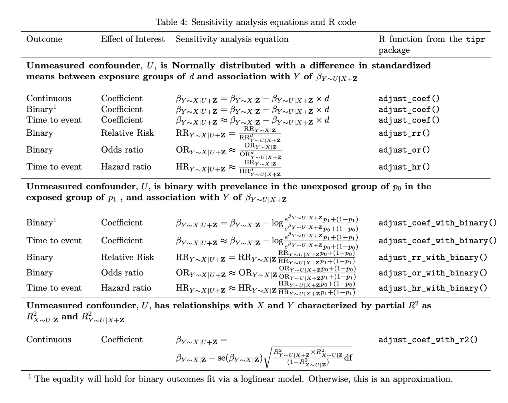
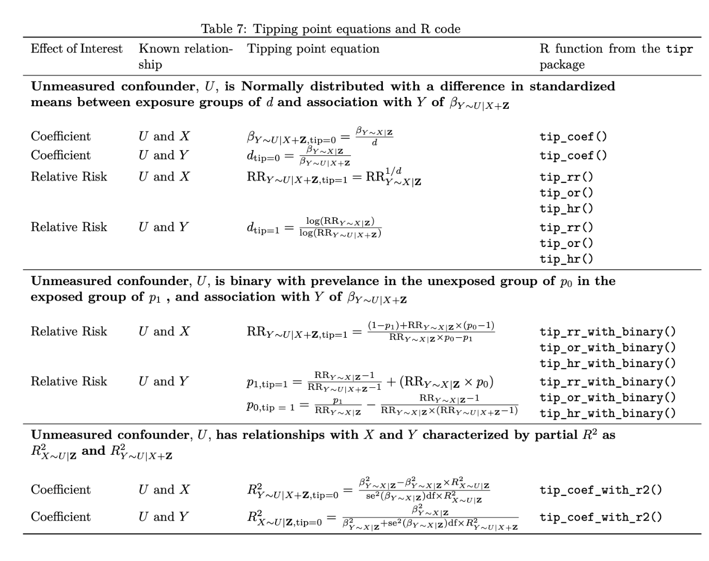

```{r setup, include=FALSE}
knitr::opts_chunk$set(warning = FALSE, message = FALSE, 
                      fig.retina = 3, fig.align = "center")
```


```{r xaringanExtra, echo=FALSE}
xaringanExtra::use_xaringan_extra(c("tile_view"))
library(tidyverse)
```

class: center middle main-title section-title-1

# Sensitivity Analyses

.class-info[

**Session 19**

.light[STA 379/679: Causal Inference <br>
Lucy D'Agostino McGowan
]

]

---

class: title title-1

# Unmeasured confounder

.box-1.medium[Untestable (but necessary!) assumption]

.box-1.medium[What happens if it is wrong?]

--

.box-inv-1.medium[Bias!]

---

class: title title-1

# Meaningful confounders

.box-1[How **imbalanced** is the unmeasured confounder between exposure groups?]

--

.box-1[How **predictive** is the unmeasured confounder of the outcome?]

--

.box-1[How **independent** is the unmeasured confounder from the measured confounders?]

---

class: title title-1

# All you need

.box-1.medium[Exposure-outcome effect]

--

.box-1.medium[Exposure-unmeasured confounder effect]

--

.box-1.medium[Outcome-unmeasured confounder effect]

---

class: title title-1

# All you need

.box-inv-1.medium[Exposure-outcome effect]


.box-2.medium[Exposure-unmeasured confounder effect]


.box-2.medium[Outcome-unmeasured confounder effect]

---
class: title title-1

# Exposure-Outcome effect 

.pull-left[

.box-1[
What we want
]

]

.pull-right[

.box-1[What we have]
]
---

class: title title-1

# Exposure-Outcome effect

.pull-left[

.box-1[
What we want
]

<br>

.box-inv-1[
$$Y \sim X | U + \mathbf{Z}$$
]
]

.pull-right[

.box-1[What we have]
]
---

class: title title-1

# Exposure-Outcome effect

.pull-left[

.box-1[
What we want
]

<br>

.box-inv-1[
$$Y \sim X | U + \mathbf{Z}$$
]

<br>

.box-inv-1[
$$\beta_{Y \sim X | U + \mathbf{Z}}$$
]
]

.pull-right[

.box-1[What we have]
]
---


class: title title-1
# Exposure-Outcome effect

.pull-left[

.box-1[
What we want
]

<br>

.box-inv-1[
$$Y \sim X | U + \mathbf{Z}$$
]

<br>

.box-inv-1[
$$\beta_{Y \sim X | U + \mathbf{Z}}$$
]
]

.pull-right[

.box-1[What we have]

<br>

.box-inv-1[
$$Y \sim X | \mathbf{Z}$$
]

<br>

.box-inv-1[
$$\beta_{Y \sim X | \mathbf{Z}}$$
]
]
---

class: title title-1

# All you need

.box-2.medium[Exposure-outcome effect]


.box-inv-1.medium[Exposure-unmeasured confounder effect]


.box-inv-1.medium[Outcome-unmeasured confounder effect]

---

class: title title-1

# All you need

.box-2.medium[Exposure-outcome effect]


.box-inv-1.medium[Exposure-unmeasured confounder effect]

<br>

.box-1[
$d$: the difference in the standardized mean between exposure groups
]

.box-inv-1.medium[Outcome-unmeasured confounder effect]

---

class: title title-1

# All you need

.box-2.medium[Exposure-outcome effect]


.box-inv-1.medium[Exposure-unmeasured confounder effect]


.box-inv-1.medium[Outcome-unmeasured confounder effect]

<br>

.box-1[
$$\beta_{Y\sim U | X + \mathbf{Z}}$$
]

---

class: title title-1

# Sensitivity Analysis

.box-1[
$$\beta_{Y\sim X |U +\mathbf{Z}} = \beta_{Y\sim X | \mathbf{Z}}-\beta_{Y\sim U|X+\mathbf{Z}}\times d$$
]

---

class: title title-1

# tipr

```{r, eval = FALSE}
library(tipr)
adjust_coef(effect = 1.5,
            smd = 0.1,
            outcome_association = 1)
```

---

class: title title-1

# tipr

```{r, eval = FALSE}
library(tipr)
adjust_coef(effect = 1.5, #<<
            smd = 0.1,
            outcome_association = 1)
```

---

class: title title-1

# tipr

```{r, eval = FALSE}
library(tipr)
adjust_coef(effect = 1.5,
            smd = 0.1, #<<
            outcome_association = 1)
```

---

class: title title-1

# tipr

```{r, eval = FALSE}
library(tipr)
adjust_coef(effect = 1.5,
            smd = 0.1,
            outcome_association = 1) #<<
```
---

class: title title-1

# tipr

```{r}
library(tipr)
adjust_coef(effect = 1.5,
            smd = 0.1,
            outcome_association = 1)
```

---

class: title title-1

# tipr

```
The observed effect (1.5) is updated to 1.4 by a confounder with
the following specifications:
* estimated difference in scaled means: 0.1
* estimated association between the unmeasured confounder and 
*  the outcome: 1
```

---

class: title title-1

# `r fontawesome::fa("laptop")` Application Exercise

1. `devtools::install_github("LucyMcGowan/tipr")`
2. You observed a causal effect of 2 (coefficient from a linear model). You think there could be an unmeasured confounder with a difference in scaled means of 0.5 and a outcome association of 1.2. Use the `adjust_coef()` function to update your observed effect
3. Try to find an unmeasured confounder that would *nullify* your result (make it 0).
4. Knit, commit, push to GitHub

`r countdown::countdown(8, font_size = "1em")`

---
class: title title-1

# All you need

.box-2.medium[Exposure-outcome effect]


.box-inv-1.medium[Exposure-unmeasured confounder effect]


.box-2.medium[Outcome-unmeasured confounder effect]

---


class: title title-1

# All you need

.box-2.medium[Exposure-outcome effect]


.box-2.medium[Exposure-unmeasured confounder effect]


.box-inv-1.medium[Outcome-unmeasured confounder effect]


---

class: title title-1

# Tipping Point Analysis

.box-1.medium[What will tip our confidence bound to cross the null?]

---

class: title title-1

# Tipping Point Analysis

.box-1[
$$0 = \beta_{Y\sim X | \mathbf{Z}}-\beta_{Y\sim U|X+\mathbf{Z}}\times d$$
]

---

class: title title-1

# Tipping Point Analysis

.box-1[
$$\beta_{Y\sim U |X+\mathbf{Z}, \textrm{tip} = 0} =\frac{\beta_{Y\sim X | \mathbf{Z}}}{d}$$
]

---


class: title title-1

# tipr

```{r}
library(tipr)
tip_lm(effect = 1.5,
        smd = 0.1)
```

---

class: title title-1

# tipr

```
The observed effect (1.5) WOULD be tipped by 1 unmeasured 
confounder with the following specifications:
  * estimated difference in scaled means between the 
    unmeasured confounder in the exposed population and 
    unexposed population: 0.1
  * estimated association between the unmeasured confounder 
    and the outcome: 15
```

---

class: title title-1

# tipr

```{r}
library(tipr)
tip_lm(effect = 1.5,
        outcome_association = 1)
```

---


class: title title-1

# tipr

```
The observed effect (1.5) WOULD be tipped by 1 unmeasured 
confounder with the following specifications:
  * estimated difference in scaled means between the 
    unmeasured confounder in the exposed population 
    and unexposed population: 1.5
  * estimated association between the unmeasured confounder 
    and the outcome: 1
```

---

class: title title-1

# `r fontawesome::fa("laptop")` Application Exercise

1. You observed a causal effect of 2 (coefficient from a linear model). You think there could be an unmeasured confounder with a difference in scaled means of 0.5. Use the `tip_lb()` function to find an unmeasured confounder-outcome relationship that would be needed to render your causal effect inconclusive
2. Knit, commit, push to GitHub

`r countdown::countdown(8, font_size = "1em")`

---

class: title title-1

# Sensitivity analysis


.box-1[Under the assumption that the sensitivity parameters are
fixed, the variance of the observed effect is the same as the variance of the adjusted effect]

.box-1[This allows all adjustments to apply to confidence intervals the same way they would apply to point estimates]

---

class: center, middle

</img>
---
class: center, middle

</img>

---

class: title title-1

# `r fontawesome::fa("laptop")` Application Exercise

1. Try applying these techniques to your Lab 04

`r countdown::countdown(8, font_size = "1em")`
