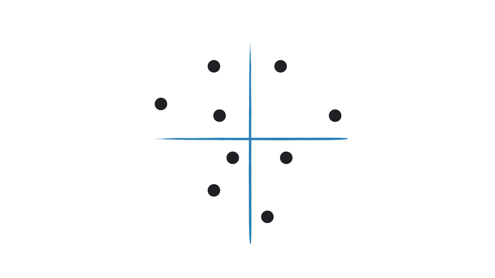
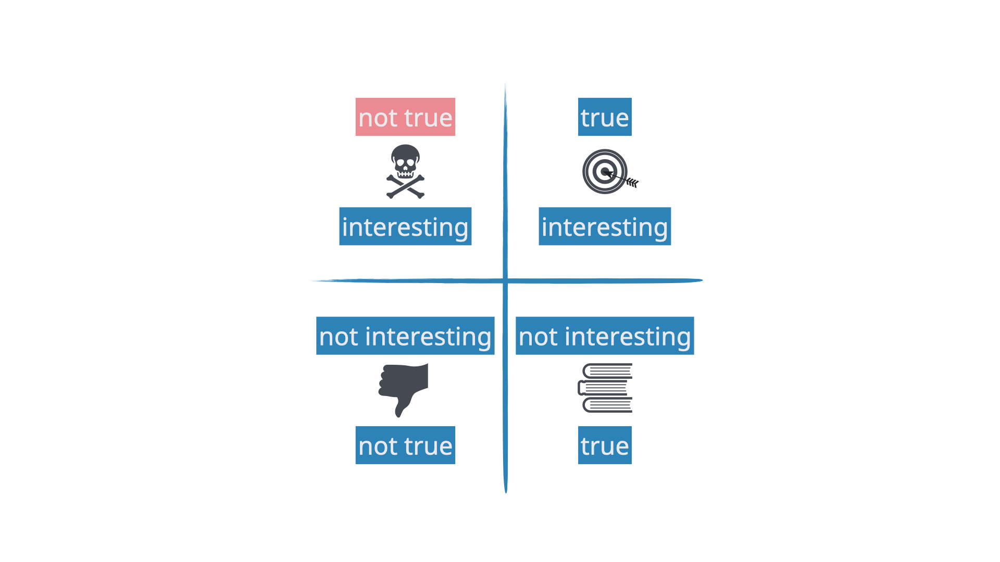

```{r setup, include=FALSE}
knitr::opts_chunk$set(warning = FALSE, message = FALSE, 
                      fig.retina = 3, fig.align = "center")
```


```{r xaringanExtra, echo=FALSE}
xaringanExtra::use_xaringan_extra(c("tile_view"))
library(tidyverse)
```

class: center middle main-title section-title-1

# Communicating Statistics

.class-info[

**Session 20**

.light[STA 379/679: Causal Inference <br>
Lucy D'Agostino McGowan
]

]
---


---


---


---


---


---


---


---


---


---


---


---


---


---


---


---


---


---


---


---


---


---


---


---


---


---


---

class: section-title section-title-1 middle center

# Putting your stats on the web!


---

class: title title-1

# `r fontawesome::fa("laptop")` Application Exercise

1. Go to Github.com and create a (public) repo called "website-demo"
2. Pull this into RStudio by creating a new project

`r countdown::countdown(5, font_size = "2em")`

---
class: title title-1

# Demo

.box-1[_site.yml]

.box-1[index.Rmd]

.box-1[analysis.Rmd]

---
class: title title-1

# YAML

.box-1[We're going to start with a site configuration file called `_site.yml`]

--

.box-1[This is written in YAML, it contains information about your website]

---
class: title title-1
# YAML

```
name: "example-website"
navbar: 
  title: "This is an example!"
  left: 
    - text: "Home"
      href: index.html
    - text: "Analysis"
      href: analysis.html
   right: 
     - icon: fa-github fa-lg
       href: https://github.com/lucymcgowan
output:
  html_document:
    theme: flatly
```

---

class: title title-1

# `r fontawesome::fa("laptop")` Application Exercise

1. Using the previous example, create a YAML for your website

`r countdown::countdown(5, font_size = "2em")`

---

class: title title-1

# index.Rmd

```
---
title: "Example Website"
---

This is markdown

  * I can include bullets

## I can include headers


I can include <i> html</i>

```

---

class: title title-1

# `r fontawesome::fa("laptop")` Application Exercise

1. Using the previous example, create an index.Rmd file
2. Knit this file

`r countdown::countdown(5, font_size = "2em")`

---


class: title title-1

# analysis.Rmd

.box-1[You can put any R Code into these Rmd files!]

.box-1[For example, let's copy your lab into a file called "analysis.Rmd"]

---

class: title title-1

# `r fontawesome::fa("laptop")` Application Exercise

1. Copy your lab 04 into a file called analysis.Rmd
2. Knit this file
3. Commit and push your files to GitHub

`r countdown::countdown(5, font_size = "2em")`

---

class: title title-1

# Deploying your website


---

class: title title-1

# Deploying your website

</img>


---

class: title title-1

# Deploying your website


---

class: title title-1

# `r fontawesome::fa("laptop")` Application Exercise

1. Deploy your website
2. See if you can update your theme (Available themes:
https://bootswatch.com/3/)
3. See if you can find different icons to include (https://fontawesome.com/icons)

`r countdown::countdown(5, font_size = "2em")`

---

class: section-title section-title-1 middle center

# Personal website

---

class: section-title section-title-1 middle center

# `install.packages("postcards")`

---
class: title title-1 center

# jolla

</img>
---
class: title title-1 center

# jolla-blue

</img>


---
class: title title-1 center

# trestles

</img>


---
class: title title-1 center

# solana

</img>

---


class: title title-1 center

# onofre

</img>

---

class: title title-1

# `r fontawesome::fa("laptop")` Application Exercise

1. `install.packages("postcards")`
2. Create a GitHub repo named YOUR_GITHUB_HANDLE.github.io (mine would be lucymcgowan.github.io)

`r countdown::countdown(5, font_size = "2em")`

---

class: title title-1

# postcards

.box-1.medium[Create a new project using a `postcards` template]

</img>

---

class: title title-1

# postcards

.box-1.medium[Add version control]

</img>

---

class: title title-1

# postcards

.box-1.medium[Add version control]

<center>
</img>
</center>
---

class: title title-1

# postcards

.box-1.medium[Add version control]

.box-1[In the terminal:]

.small[
```
git remote add origin https://github.com/YOUR-GITHUB-HANDLE.github.io.git
```
]

---


class: title title-1

# `r fontawesome::fa("laptop")` Application Exercise

1. Create a project from the postcard template
2. Add git to your project
3. Connect to Github using the previous slide (via the terminal)
4. Update the template to reflect your details!
5. Update to enable Github pages

`r countdown::countdown(10, font_size = "1em")`

---

class: section-title section-title-1

# flexdashboard

